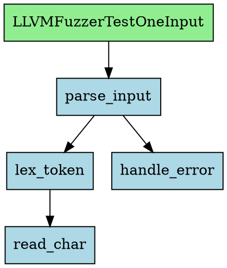

## 9. 独立使用场景

### 9.1 工单 JSON

所有分析任务通过**工单 JSON** 驱动，不使用命令行参数。

**创建工单模板：**
```bash
z-analyze create-work -o work.json
```

**工单格式：**
```json
{
  "repo_url": "https://github.com/curl/curl",
  "version": "curl-8_5_0",
  "path": "./curl-src",
  "build_script": "./ossfuzz/build.sh",
  "backend": "svf",
  "language": "c",
  "fuzzer_sources": {
    "curl_fuzzer_http": ["fuzz/fuzz_http.c", "fuzz/fuzzer_template.c"],
    "curl_fuzzer_ftp": ["fuzz/fuzz_ftp.c", "fuzz/fuzzer_template.c"],
    "curl_fuzzer_smtp": ["fuzz/fuzz_smtp.c"]
  },
  "diff_files": null,
  "ai_refine": false
}
```

**字段说明：**

| 字段 | 必填 | 类型 | 说明 |
|------|------|------|------|
| `repo_url` | Y | str | 仓库地址 |
| `version` | Y | str | tag 或 commit hash |
| `path` | N | str | 本地项目路径，不传则自动 clone |
| `build_script` | N | str | 构建脚本路径，不传则自动检测/LLM 推断 |
| `backend` | N | str | 分析后端，默认 `"auto"` |
| `language` | N | str | 主语言（`"c"` / `"cpp"`），不传则自动探测 |
| `fuzzer_sources` | Y | dict | fuzzer 名 → 源文件列表（list[str]） |
| `diff_files` | N | list[str] | 增量分析的变更文件 |
| `ai_refine` | N | bool | 启用 AI 精化（v1 预留） |

> **fuzzer_sources 必传**：v1 不支持自动检测 fuzzer，用户必须指定每个 fuzzer 的名称和源文件。

**执行分析：**
```bash
# 使用工单 JSON 执行分析
z-analyze run work.json --neo4j-uri bolt://localhost:7687 --mongo-uri mongodb://localhost:27017

# 查询已有数据
z-query shortest-path --repo-url https://github.com/curl/curl \
           --version curl-8_5_0 \
           LLVMFuzzerTestOneInput dict_do

z-query search --repo-url https://github.com/curl/curl \
           --version curl-8_5_0 "dict_*"

# 列出所有已有 Snapshot
z-snapshots list
z-snapshots list --repo-url https://github.com/curl/curl
```

**CLI 实现（基于 Click）：**
```python
# z_code_analyzer/cli.py

import click

@click.group()
def main():
    """Z-Code Analyzer Station"""

@main.command("create-work")
@click.option("-o", "--output", default="work.json", help="输出文件路径")
def create_work(output):
    """创建工单模板"""
    create_work_template(output)

@main.command("run")
@click.argument("work_file", type=click.Path(exists=True))
@click.option("--neo4j-uri", default="bolt://localhost:7687")
@click.option("--neo4j-auth", default=None, help="Neo4j auth ('none' or 'user:password')")
@click.option("--mongo-uri", default="mongodb://localhost:27017")
def run(work_file, neo4j_uri, neo4j_auth, mongo_uri):
    """执行分析"""
    work = json.loads(Path(work_file).read_text())
    auth = _resolve_auth(neo4j_auth)
    graph = GraphStore(neo4j_uri, auth)
    sm = SnapshotManager(mongo_uri=mongo_uri, graph_store=graph)
    orchestrator = StaticAnalysisOrchestrator(
        snapshot_manager=sm, graph_store=graph
    )

    project_path = work.get("path")
    if not project_path:
        project_path = auto_clone(work["repo_url"], work["version"])

    result = asyncio.run(orchestrator.analyze(
        project_path=project_path,
        repo_url=work["repo_url"],
        version=work["version"],
        fuzzer_sources=work["fuzzer_sources"],
        build_script=work.get("build_script"),
        backend=work.get("backend"),
        diff_files=work.get("diff_files"),
    ))

    click.echo(f"Snapshot: {result.snapshot_id}")
    click.echo(f"Functions: {result.function_count}, Edges: {result.edge_count}")
    click.echo(f"Fuzzers: {result.fuzzer_names}")
    click.echo(f"Backend: {result.backend}")
```

### 9.2 REST API（v2 计划，未实现）

> **v1 状态**: 仅提供 CLI 接口（§9.1）。以下 REST API 为 v2 预留设计。

异步分析接口，适用于 Web 集成。

```
POST /api/analyze
  Body: 工单 JSON（格式同 §9.1）
  Response:
    {
      "job_id": "abc-123",
      "status": "queued"
    }

GET /api/analyze/{job_id}
  Response:
    {
      "job_id": "abc-123",
      "status": "completed",    // "queued" | "running" | "completed" | "failed"
      "progress": {
        "phase": "import",
        "phases_completed": 5,
        "phases_total": 6
      },
      "result": { ... AnalysisOutput JSON ... }
    }

GET /api/analyze/{job_id}/callgraph?format=dot
  Response: DOT 格式调用图

GET /api/analyze/{job_id}/functions?pattern=parse.*
  Response: 函数列表
```

### 9.3 输出格式（v2 计划，未实现）

> **v1 状态**: CLI `run` 命令输出文本摘要（Snapshot ID、函数数、边数等）。
> 以下 JSON / DOT / GraphML 导出格式为 v2 预留设计。

**JSON（默认）：**
```json
{
  "backend": "svf",
  "language": "c",
  "analysis_duration_seconds": 1.23,
  "functions": [
    {
      "name": "parse_input",
      "file_path": "src/parser.c",
      "start_line": 42,
      "end_line": 87,
      "cyclomatic_complexity": 12,
      "language": "c"
    }
  ],
  "edges": [
    {
      "caller": "main",
      "callee": "parse_input",
      "call_type": "direct",
      "confidence": 1.0
    }
  ],
  "fuzzer_sources": {
    "fuzz_parse": ["fuzz/fuzz_parse.c"]
  },
  "warnings": []
}
```

**DOT（Graphviz）：**


**GraphML：**
```xml
<?xml version="1.0" encoding="UTF-8"?>
<graphml xmlns="http://graphml.graphstruct.org/xmlns">
  <key id="d0" for="node" attr.name="file" attr.type="string"/>
  <key id="d1" for="edge" attr.name="call_type" attr.type="string"/>
  <graph id="G" edgedefault="directed">
    <node id="parse_input">
      <data key="d0">src/parser.c</data>
    </node>
    <edge source="main" target="parse_input">
      <data key="d1">direct</data>
    </edge>
  </graph>
</graphml>
```

---
