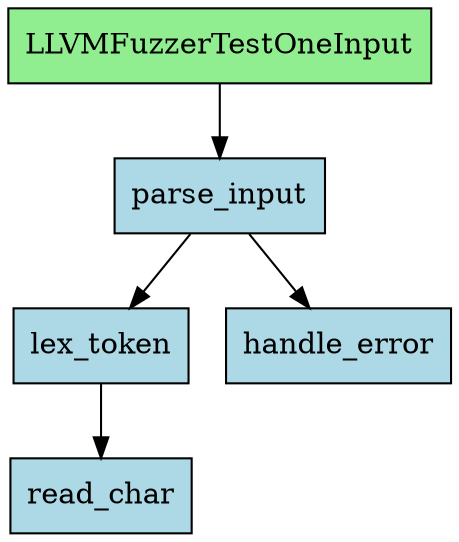

## 9. 独立使用场景

### 9.1 工单 JSON

所有分析任务通过**工单 JSON** 驱动，不使用命令行参数。

**创建工单模板：**
```bash
z-analyze create-work -o work.json
```

**工单格式：**
```json
{
  "repo_url": "https://github.com/curl/curl",
  "version": "curl-8_5_0",
  "path": "./curl-src",
  "build_script": "./ossfuzz/build.sh",
  "backend": "svf",
  "language": "c",
  "fuzzer_sources": {
    "curl_fuzzer_http": ["fuzz/fuzz_http.c", "fuzz/fuzzer_template.c"],
    "curl_fuzzer_ftp": ["fuzz/fuzz_ftp.c", "fuzz/fuzzer_template.c"],
    "curl_fuzzer_smtp": ["fuzz/fuzz_smtp.c"]
  },
  "diff_files": null,
  "ai_refine": false
}
```

**字段说明：**

| 字段 | 必填 | 类型 | 说明 |
|------|------|------|------|
| `repo_url` | Y | str | 仓库地址 |
| `version` | Y | str | tag 或 commit hash |
| `path` | N | str | 本地项目路径，不传则自动 clone |
| `build_script` | N | str | 构建脚本路径，不传则自动检测/LLM 推断 |
| `backend` | N | str | 分析后端，默认 `"auto"` |
| `language` | N | str | 主语言（`"c"` / `"cpp"`），不传则自动探测 |
| `fuzzer_sources` | Y | dict | fuzzer 名 → 源文件列表（list[str]） |
| `fuzz_tooling_url` | N | str | 外部 fuzzer harness 仓库 URL（如 oss-fuzz），null = harness 在项目内 |
| `fuzz_tooling_ref` | N | str | fuzz_tooling_url 的分支/tag/commit，null = 默认分支 |
| `diff_files` | N | list[str] | 增量分析的变更文件 |
| `ai_refine` | N | bool | 启用 AI 精化（v1 预留） |

> **fuzzer_sources 必传**：v1 不支持自动检测 fuzzer，用户必须指定每个 fuzzer 的名称和源文件。

**执行分析：**
```bash
# 使用工单 JSON 执行分析
z-analyze run work.json --neo4j-uri bolt://localhost:7687 --mongo-uri mongodb://localhost:27017

# 查询已有数据
z-query shortest-path --repo-url https://github.com/curl/curl \
           --version curl-8_5_0 \
           LLVMFuzzerTestOneInput dict_do

z-query search --repo-url https://github.com/curl/curl \
           --version curl-8_5_0 "dict_*"

# 列出所有已有 Snapshot
z-snapshots list
z-snapshots list --repo-url https://github.com/curl/curl
```

**CLI 入口（基于 Click，3 个命令组）：**

```bash
# z-analyze: 分析入口
z-analyze -v create-work -o work.json     # 创建工单模板
z-analyze run work.json                    # 执行分析
z-analyze probe /path/to/project           # 快速项目探测（Phase 1）

# z-query: 查询分析结果
z-query shortest-path --repo-url URL --version TAG from_func to_func
z-query search --repo-url URL --version TAG "pattern*"

# z-snapshots: 快照管理
z-snapshots list [--repo-url URL]
```

所有命令支持 `-v / --verbose` 全局选项。`--neo4j-uri` / `--mongo-uri` 默认读取环境变量
`NEO4J_URI` / `MONGO_URI`，未设置时使用 `bolt://localhost:7687` / `mongodb://localhost:27017`。

`run` 命令输出示例：
```
Analysis complete:
  Snapshot ID: 6789abcd...
  Backend: svf
  Functions: 641
  Edges: 2325
  Fuzzers: ['fuzz_read']

Pipeline summary (total: 12.3s):
  [+] probe (0.1s) - lang=c, build=autotools, files=42
  [+] build_cmd (0.0s) - autotools (source: auto_detect)
  [+] bitcode (8.2s) - bc=library.bc, metas=641
  [+] svf (3.5s) - functions=641, edges=2325, fptr=128
  [+] fuzzer_parse (0.1s) - 1 fuzzers, lib_calls=5
  [-] ai_refine - v1: not implemented
  [+] import (0.4s) - functions=641, edges=2325, reaches=412, fuzzers=1
```

### 9.2 REST API（v2 计划，未实现）

> **v1 状态**: 仅提供 CLI 接口（§9.1）。以下 REST API 为 v2 预留设计。

异步分析接口，适用于 Web 集成。

```
POST /api/analyze
  Body: 工单 JSON（格式同 §9.1）
  Response:
    {
      "job_id": "abc-123",
      "status": "queued"
    }

GET /api/analyze/{job_id}
  Response:
    {
      "job_id": "abc-123",
      "status": "completed",    // "queued" | "running" | "completed" | "failed"
      "progress": {
        "phase": "import",
        "phases_completed": 5,
        "phases_total": 6
      },
      "result": { ... AnalysisOutput JSON ... }
    }

GET /api/analyze/{job_id}/callgraph?format=dot
  Response: DOT 格式调用图

GET /api/analyze/{job_id}/functions?pattern=parse.*
  Response: 函数列表
```

### 9.3 输出格式（v2 计划，未实现）

> **v1 状态**: CLI `run` 命令输出文本摘要（Snapshot ID、函数数、边数等）。
> 以下 JSON / DOT / GraphML 导出格式为 v2 预留设计。

**JSON（默认）：**
```json
{
  "backend": "svf",
  "language": "c",
  "analysis_duration_seconds": 1.23,
  "functions": [
    {
      "name": "parse_input",
      "file_path": "src/parser.c",
      "start_line": 42,
      "end_line": 87,
      "cyclomatic_complexity": 12,
      "language": "c"
    }
  ],
  "edges": [
    {
      "caller": "main",
      "callee": "parse_input",
      "call_type": "direct",
      "confidence": 1.0
    }
  ],
  "fuzzer_sources": {
    "fuzz_parse": ["fuzz/fuzz_parse.c"]
  },
  "warnings": []
}
```

**DOT（Graphviz）：**


**GraphML：**
```xml
<?xml version="1.0" encoding="UTF-8"?>
<graphml xmlns="http://graphml.graphstruct.org/xmlns">
  <key id="d0" for="node" attr.name="file" attr.type="string"/>
  <key id="d1" for="edge" attr.name="call_type" attr.type="string"/>
  <graph id="G" edgedefault="directed">
    <node id="parse_input">
      <data key="d0">src/parser.c</data>
    </node>
    <edge source="main" target="parse_input">
      <data key="d1">direct</data>
    </edge>
  </graph>
</graphml>
```

---
