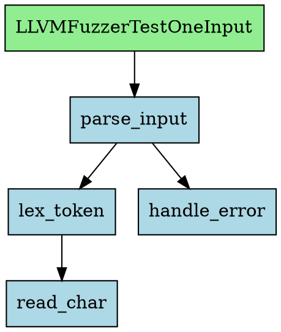

# 静态分析系统完整设计

> 架构独立的多后端静态分析引擎，支持多语言、多分析后端的可插拔架构，与 FuzzingBrain 管道无缝集成，也可独立使用。

---

## 目录

1. [系统概览](#1-系统概览)
2. [多后端编排](#2-多后端编排)
3. [后端注册与能力声明](#3-后端注册与能力声明)
4. [结果合并策略](#4-结果合并策略)
5. [AI 集成点](#5-ai-集成点)
6. [语言检测与工具链自动选择](#6-语言检测与工具链自动选择)
7. [分析管道](#7-分析管道)
8. [与 FuzzingBrain 管道集成](#8-与-fuzzingbrain-管道集成)
9. [独立使用场景](#9-独立使用场景)
10. [实施路线图](#10-实施路线图)
11. [关键设计决策记录](#11-关键设计决策记录)
12. [性能基准目标](#12-性能基准目标)

---

## 1. 系统概览

### 1.1 定位

静态分析系统是 FuzzingBrain-V2 的**代码理解引擎**。它从源代码中提取函数元信息和调用图，供下游 AI Agent 做漏洞发现、方向规划和 POV 生成。

当前系统与 fuzz-introspector 强耦合——所有静态分析数据要么来自 LLVM Pass（需要 Docker + OSS-Fuzz 编译），要么来自预计算 JSON。本设计将其重构为**架构独立的多后端分析引擎**，支持多语言、多精度后端的可插拔组合。

### 1.2 核心目标

本系统目前只做两件事：

1. **函数元信息提取** — 项目中有哪些函数（名称、文件、行号、源码、复杂度）
2. **调用图构建** — 函数之间的调用关系（谁调用了谁）

所有下游能力（可达性判断、BFS 距离、reached_by_fuzzers）都是从这两个数据**派生**出来的，不是分析后端的职责。

**准确性要求：**

- 函数提取必须完整 — 漏掉一个函数意味着 Agent 无法分析到它
- 调用图必须完整 — 漏掉一条边意味着可达性分析断裂，Agent 可能错过整条攻击路径
- **宁可多报，不能漏报** — 多一条假边只是让 Agent 多探索一个分支，少一条真边则可能错过漏洞

这决定了我们的后端选择策略：**始终选择能力最强的后端**，确保虚函数、函数指针、宏展开、模板等场景下的调用边不被遗漏ß

### 1.3 核心能力

| 能力 | 说明 |
|------|------|
| **多后端可插拔** | SVF（LLVM IR 指针分析）、Joern（CPG 多语言）、Tree-sitter（语法级兜底）、Introspector、Prebuild |
| **三层降级** | SVF（最强精度，需编译）→ Joern（中等精度，不需编译）→ Tree-sitter（兜底） |
| **Neo4j 图存储** | 调用图 + 函数元数据存 Neo4j，原生图遍历，实时路径查询（百万节点毫秒级） |
| **项目级持久化** | 以 `(repo_url, version, backend)` 为 key，脱离 task 生命周期，跨 task 复用 |
| **多语言支持** | 通过 LanguageDetector 自动检测，ToolchainSelector 选择最优后端 |
| **AI 辅助精化** | LLM 解析间接调用、虚函数分派、冲突裁决（可选、异步、可降级） |
| **增量分析** | 仅分析 git diff 变更的文件，与 delta scan 模式集成 |
| **独立使用** | CLI / REST API，脱离 FuzzingBrain 管道也能运行 |

### 1.4 系统边界图

```
┌─────────────────────────────────────────────────────────────────────────┐
│                        FuzzingBrain Pipeline                            │
│                                                                         │
│  TaskProcessor → WorkspaceSetup → FuzzerDiscovery → AnalysisServer     │
│                                                        │                │
│                                                   ┌────┴────┐          │
│                                                   │ Phase 1 │ 构建     │
│                                                   │ (不变)  │          │
│                                                   ├─────────┤          │
│                                                   │ Phase 2 │◄── 改造  │
│                                                   │ _analysis_phase()  │
│                                                   ├─────────┤          │
│                                                   │ Phase 3 │ 查询服务 │
│                                                   │ (不变)  │          │
│                                                   └────┬────┘          │
│                                                        │                │
│  WorkerDispatcher → AgentPipeline → MCP tools ─────────┘                │
│    (DirectionPlanning / SPGenerator / SPVerifier / POVAgent)            │
└─────────────────────────────────────────────────────────────────────────┘
                                 ▲
                                 │ Phase 2 调用
                                 ▼
┌─────────────────────────────────────────────────────────────────────────┐
│                     Static Analysis System（本设计）                     │
│                                                                         │
│  ┌──────────────────┐    ┌───────────────────┐    ┌─────────────────┐  │
│  │ LanguageDetector  │───▶│ToolchainSelector  │───▶│ Orchestrator    │  │
│  │ 语言检测          │    │ 工具链选择        │    │ 编排执行        │  │
│  └──────────────────┘    └───────────────────┘    └────────┬────────┘  │
│                                                            │           │
│                    ┌───────────────────────────────────────┤           │
│                    ▼               ▼              ▼        ▼           │
│  ┌──────────┐ ┌──────────┐ ┌────────────┐ ┌──────────┐ ┌──────────┐  │
│  │   SVF    │ │  Joern   │ │Tree-sitter │ │Introspect│ │ Prebuild │  │
│  │ (LLVM IR)│ │  (CPG)   │ │ (语法级)   │ │  (兼容)  │ │ (导入)   │  │
│  └─────┬─────┘ └────┬─────┘ └─────┬──────┘ └────┬─────┘ └────┬─────┘  │
│        │            │             │             │                      │
│        └────────────┴──────┬──────┴─────────────┘                      │
│                            ▼                                           │
│                    ┌──────────────┐     ┌──────────────┐              │
│                    │ResultMerger  │────▶│ AI Refiner   │              │
│                    │ 结果合并     │     │ (可选)       │              │
│                    └──────┬───────┘     └──────┬───────┘              │
│                           │                    │                      │
│                           └────────┬───────────┘                      │
│                                    ▼                                   │
│                           ┌──────────────┐                            │
│                           │ GraphImporter │                            │
│                           │   → Neo4j    │                            │
│                           └──────────────┘                            │
└─────────────────────────────────────────────────────────────────────────┘
                                 ▲
                                 │ 独立使用
                                 │
┌─────────────────────────────────────────────────────────────────────────┐
│  独立入口                                                               │
│  ├── CLI: fuzzingbrain-analyze /path/to/project                        │
│  ├── REST API: POST /api/analyze                                       │
│  └── Python API: StaticAnalysisOrchestrator.analyze()                  │
└─────────────────────────────────────────────────────────────────────────┘
```

### 1.5 数据存储：Neo4j 图数据库

**设计决策：** 静态分析结果全部存储在 Neo4j 中，不再使用 MongoDB 的 `functions` / `callgraph_nodes` 集合。

**为什么不用 MongoDB：**
- `_id = {task_id}_{name}` 把项目级事实绑死在 task 上，无法跨 task 复用
- 调用图存为邻接数组（`callers[]` / `callees[]`）是反模式 — 加边要两端 `$push`，一致性靠应用层保证
- `reached_by_fuzzers` 冗余存储可达性，实时计算不可行（需应用层 BFS + 全量加载）
- 百万行项目（50K+ 节点 / 500K+ 边），MongoDB 做路径查询完全不可行

**为什么选 Neo4j：**
- 调用图 = 天然的图结构，节点是函数，边是调用关系
- `shortestPath`、可达性、BFS 深度 — 全部原生支持，百万节点毫秒级
- 边的方向就是 caller → callee，不需要维护双向数组
- 函数元数据（源码、复杂度等）作为节点属性存储，单一数据源

#### 1.5.1 图数据模型

```
(:Snapshot {
    repo_name: "curl",
    repo_url: "https://github.com/curl/curl",
    version: "curl-8_5_0",          // tag / commit hash / "latest"
    backend: "svf",                  // 产出此快照的后端
    created_at: datetime
})
  │
  ├──[:CONTAINS]──→ (:Function {
  │                     name: "dict_do",
  │                     file_path: "lib/dict.c",
  │                     start_line: 142,
  │                     end_line: 210,
  │                     content: "void dict_do(...) { ... }",
  │                     cyclomatic_complexity: 15,
  │                     language: "c"
  │                 })
  │                     │
  │                     ├──[:CALLS {call_type: "direct", confidence: 1.0, backend: "svf"}]──→ (:Function)
  │                     └──[:CALLS {call_type: "indirect", confidence: 0.95, backend: "svf"}]──→ (:Function)
  │
  ├──[:CONTAINS]──→ (:Function:External {name: "malloc"})    // 外部函数（libc/syscall），叶节点
  │
  └──[:CONTAINS]──→ (:Fuzzer {
                        name: "curl_fuzzer",
                        entry_function: "LLVMFuzzerTestOneInput",
                        focus: "HTTP",                        // 模板 fuzzer 的协议聚焦
                        seed_dir: "http_corpus/"
                    })
                        │
                        └──[:ENTRY]──→ (:Function {name: "LLVMFuzzerTestOneInput", ...})
```

#### 1.5.2 节点类型

| 标签 | 属性 | 说明 |
|------|------|------|
| `:Snapshot` | `repo_name`, `repo_url`, `version`, `backend`, `created_at` | 一次分析快照，唯一约束: `(repo_url, version, backend)` |
| `:Function` | `name`, `file_path`, `start_line`, `end_line`, `content`, `cyclomatic_complexity`, `language` | 用户代码函数，唯一约束: 同一 Snapshot 内 `(name, file_path)` |
| `:Function:External` | `name` | 外部函数（`malloc`, `printf` 等），SVF 无法分析内部，作为叶节点 |
| `:Fuzzer` | `name`, `entry_function`, `focus`, `seed_dir` | Fuzzer 入口，指向其 entry point 函数 |

#### 1.5.3 边类型

| 关系 | 方向 | 属性 | 说明 |
|------|------|------|------|
| `:CONTAINS` | Snapshot → Function/Fuzzer | — | 快照包含哪些节点 |
| `:CALLS` | Function → Function | `call_type`, `confidence`, `backend` | 调用关系（方向即 caller → callee） |
| `:ENTRY` | Fuzzer → Function | — | Fuzzer 的入口函数 |

`call_type` 枚举: `"direct"` / `"indirect"` / `"virtual"` / `"fptr"`

#### 1.5.4 关键查询示例

```cypher
// 最短路径：从函数 A 到函数 B
MATCH path = shortestPath(
  (a:Function {name: "LLVMFuzzerTestOneInput"})-[:CALLS*]->(b:Function {name: "dict_do"})
)
RETURN [n IN nodes(path) | n.name] AS path_names

// 某函数被哪些 fuzzer 可达（实时计算，不需要冗余存储）
MATCH (fz:Fuzzer)-[:ENTRY]->()-[:CALLS*]->(f:Function {name: "dict_do"})
RETURN fz.name

// 高复杂度 + 从 entry 可达 + 带源码返回
MATCH path = (:Fuzzer {name: "curl_fuzzer"})-[:ENTRY]->()-[:CALLS*1..10]->(f:Function)
WHERE f.cyclomatic_complexity > 20
RETURN f.name, f.file_path, f.content, length(path) AS depth
ORDER BY depth

// 某函数的所有 callers
MATCH (caller)-[:CALLS]->(f:Function {name: "dict_do"})
RETURN caller.name

// 某函数的所有 callees
MATCH (f:Function {name: "curl_do"})-[:CALLS]->(callee)
RETURN callee.name
```

#### 1.5.5 存储估算

| 项目规模 | 节点 | 边 | Neo4j 存储 |
|---------|------|-----|-----------|
| 小型 (libpng, 150K行) | ~640 | ~2K | < 1 MB |
| 中型 (curl, 150K行) | ~2.3K | ~18K | ~5 MB |
| 大型 (1M行) | ~50K | ~500K | ~110 MB |
| 超大型 (Chromium, 25M行) | ~200K | ~2M | ~500 MB |

函数源码是主要体积来源（~1.2KB/函数），调用图边极轻量（~150B/边）。

#### 1.5.6 与 task 的关系

```
Task（MongoDB，生命周期短）          Snapshot（Neo4j，持久化）
┌──────────────────────┐           ┌──────────────────────┐
│ task_id: ObjectId    │           │ repo_url + version   │
│ repo_url: "curl..."  │──引用──→  │ backend: "svf"       │
│ snapshot_id: "xxx"   │           │ 函数 + 调用图 + Fuzzer│
│ status: "running"    │           │ （项目级，可复用）     │
└──────────────────────┘           └──────────────────────┘
```

- Task 创建时检查 Neo4j 是否已有匹配的 Snapshot（同 repo_url + version + backend）
- 有 → 直接引用，跳过分析（秒级启动）
- 无 → 运行分析后端，结果写入 Neo4j，Task 引用新 Snapshot
- Task 结束时不删除 Snapshot — 下次复用

#### 1.5.7 模板 Fuzzer 处理

同一个项目可能有多个 fuzzer 共用模板（如 curl 的 `curl_fuzzer_http` / `curl_fuzzer_ftp`）：

- **编译期分化**（`#define`）→ 不同的 `.bc` → 不同的 SVF 调用图 → 独立 Snapshot
- **运行期分化**（配置/种子）→ 相同 `.bc` → 相同调用图 → 共享 Snapshot，Fuzzer 节点的 `focus` 字段区分意图

```cypher
// 两个 fuzzer 共享同一个 Snapshot 的调用图，但有不同的 focus
(:Fuzzer {name: "curl_fuzzer_http", focus: "HTTP"})
  └──[:ENTRY]──→ (:Function {name: "LLVMFuzzerTestOneInput", file_path: "fuzz/curl_fuzzer.cc"})

(:Fuzzer {name: "curl_fuzzer_ftp", focus: "FTP"})
  └──[:ENTRY]──→ (:Function {name: "LLVMFuzzerTestOneInput", file_path: "fuzz/curl_fuzzer.cc"})
```

**AnalysisServer 查询 API（25 个 RPC 方法，接口不变，底层改为 Neo4j 查询）：**

- 函数查询：`get_function`, `get_functions_by_file`, `search_functions`, `get_function_source`
- 调用图查询：`get_callers`, `get_callees`, `get_call_graph`, `find_all_paths`
- 可达性查询：`check_reachability`, `get_reachable_functions`, `get_unreached_functions`
- Fuzzer 信息：`get_fuzzers`, `get_fuzzer_source`, `get_build_paths`
- 状态管理：`analyzer_status`, `create_suspicious_point`, `update_suspicious_point`, `list_suspicious_points`, `create_direction`, `claim_direction`, `complete_direction` 等

> **注**: 状态管理类 RPC（suspicious_point, direction 等）仍使用 MongoDB，因为它们是 task 级别的可变状态，不属于静态分析结果。

### 1.6 Snapshot 版本管理

#### 1.6.1 MongoDB 快照目录

MongoDB 作为 Neo4j 的**元数据索引**，存储所有 Snapshot 的概览信息，支持快速检索和生命周期管理。

**`snapshots` 集合：**

| 字段 | 类型 | 说明 |
|------|------|------|
| `_id` | ObjectId | 自动生成 |
| `neo4j_snapshot_id` | str | Neo4j 中 Snapshot 节点的唯一标识 |
| `repo_url` | str | 仓库地址 |
| `repo_name` | str | 仓库名（便于展示） |
| `version` | str | tag / commit hash（不允许 branch name） |
| `backend` | str | 产出后端（`"svf"` / `"joern"` / `"introspector"` / `"prebuild"`） |
| `node_count` | int | 函数节点数 |
| `edge_count` | int | 调用边数 |
| `fuzzer_names` | list[str] | 包含的 Fuzzer 列表 |
| `language` | str | 主要语言 |
| `analysis_duration_sec` | float | 分析耗时 |
| `status` | str | `"analyzing"` / `"ready"` / `"failed"` |
| `created_at` | datetime | 创建时间 |
| `last_accessed_at` | datetime | 最后被 task 引用的时间 |
| `access_count` | int | 被 task 引用的总次数 |
| `size_bytes` | int | 预估 Neo4j 存储大小 |

**唯一索引：** `(repo_url, version, backend)`

#### 1.6.2 Snapshot 查找与复用

```python
class SnapshotManager:
    """
    Snapshot 生命周期管理器。
    MongoDB 做目录索引，Neo4j 存图本体。
    """

    def find_snapshot(self, repo_url: str, version: str,
                      preferred_backend: str = None) -> Optional[SnapshotMeta]:
        """
        查找可复用的 Snapshot。

        查找策略：
        1. 精确匹配 (repo_url, version, preferred_backend)
        2. 同版本但不同后端 — 按精度降序: svf > joern > introspector > prebuild
        3. 未命中 → 返回 None，调用方触发新分析
        """
        ...

    def on_snapshot_accessed(self, snapshot_id: str):
        """更新 last_accessed_at 和 access_count"""
        ...
```

**FBv2 集成流程：**

```
Task 启动 (repo_url, version)
  │
  ├── SnapshotManager.find_snapshot(repo_url, version)
  │     │
  │     ├── 命中 (status="ready")
  │     │     → 更新 last_accessed_at
  │     │     → 返回 neo4j_snapshot_id
  │     │     → 跳过分析，秒级启动
  │     │
  │     └── 未命中
  │           → 运行 SVF/Joern 分析
  │           → 写入 Neo4j 图 + MongoDB 目录
  │           → 返回新 neo4j_snapshot_id
  │
  └── AnalysisServer 用 snapshot_id 做所有 RPC 查询
```

#### 1.6.3 版本淘汰策略

三层淘汰机制，按优先级执行：

**策略 1：同仓库版本上限（默认保留最近 5 个）**

```python
MAX_VERSIONS_PER_REPO = 5

def evict_by_version_limit(self, repo_url: str):
    """
    同一个 repo_url 的 Snapshot 超过上限时，
    淘汰 last_accessed_at 最早的版本。
    """
    snapshots = db.snapshots.find(
        {"repo_url": repo_url, "status": "ready"}
    ).sort("last_accessed_at", -1)

    to_delete = list(snapshots)[MAX_VERSIONS_PER_REPO:]
    for snap in to_delete:
        self._delete_snapshot(snap)
```

**策略 2：磁盘水位淘汰（80% 阈值）**

```python
DISK_THRESHOLD = 0.80  # 80%

def evict_by_disk_pressure(self):
    """
    Neo4j 数据目录磁盘使用率超过阈值时，
    按 LRU (last_accessed_at) 淘汰最不常用的 Snapshot，
    直到使用率降到 70% 以下。
    """
    while get_disk_usage() > DISK_THRESHOLD:
        oldest = db.snapshots.find_one(
            {"status": "ready"},
            sort=[("last_accessed_at", 1)]
        )
        if not oldest:
            break
        self._delete_snapshot(oldest)
```

**策略 3：TTL 过期（默认 90 天未访问）**

```python
TTL_DAYS = 90

def evict_by_ttl(self):
    """
    超过 TTL 天数未被任何 task 引用的 Snapshot 自动清除。
    """
    cutoff = datetime.now() - timedelta(days=TTL_DAYS)
    expired = db.snapshots.find({
        "status": "ready",
        "last_accessed_at": {"$lt": cutoff}
    })
    for snap in expired:
        self._delete_snapshot(snap)
```

**淘汰执行顺序：**

```
定时任务（每小时 / 每次 task 启动时）
  │
  ├── 1. evict_by_disk_pressure()    ← 最优先，防止磁盘满
  ├── 2. evict_by_version_limit()    ← 控制同仓库版本膨胀
  └── 3. evict_by_ttl()              ← 清理长期无用数据
```

**删除操作：**

```python
def _delete_snapshot(self, snap: dict):
    """
    删除一个 Snapshot：
    1. Neo4j: 删除该 Snapshot 下所有节点和边
       MATCH (s:Snapshot {id: $sid})-[:CONTAINS]->(n)
       DETACH DELETE s, n
    2. MongoDB: 删除目录记录
       db.snapshots.delete_one({"_id": snap["_id"]})
    """
```

#### 1.6.4 版本对比（远期）

```python
def diff_snapshots(self, snap_a_id: str, snap_b_id: str) -> SnapshotDiff:
    """
    对比两个 Snapshot（通常是同 repo 不同 version）：
    - 新增的函数
    - 删除的函数
    - 变更的函数（content 不同）
    - 新增/删除的调用边
    用于增量分析和变更追踪。
    """
```

#### 1.6.5 配置

| 配置项 | 默认值 | 说明 |
|--------|--------|------|
| `SNAPSHOT_MAX_VERSIONS_PER_REPO` | `5` | 同仓库最多保留版本数 |
| `SNAPSHOT_DISK_THRESHOLD` | `0.80` | 磁盘水位淘汰阈值 |
| `SNAPSHOT_DISK_TARGET` | `0.70` | 淘汰后目标水位 |
| `SNAPSHOT_TTL_DAYS` | `90` | 未访问过期天数 |
| `SNAPSHOT_EVICTION_INTERVAL` | `3600` | 淘汰检查间隔（秒） |

---

## 2. 多后端编排

系统支持三种编排模式，由 `StaticAnalysisOrchestrator` 根据配置和项目特征自动选择。

### 2.1 单后端模式

最简单的模式——指定或自动选择一个后端，直接执行。

```
项目 ──▶ [选择后端] ──▶ Backend.analyze() ──▶ AnalysisResult ──▶ Neo4j
```

**使用场景：**
- 用户显式指定 `analysis_backend="tree-sitter"` / `"clang"` / `"introspector"`
- 自动模式下只有一个后端满足前置条件
- 速度优先的场景（如 CI/CD 集成）

**自动选择逻辑——三层降级链：**
```python
def auto_select_single(project_path, language) -> AnalysisBackend:
    """
    始终选择当前可用的最强后端，最大化分析准确率和召回率。

    三层降级链（精度从高到低）：

    1. SVF（C/C++）— 需要 Docker + 编译成功 + wllvm bitcode 提取
       精度最高：Andersen 指针分析，能解析函数指针、回调、协议处理表
       已验证：libpng(1.4s), lcms(7s), curl(73s) 全部正确

    2. Joern（C/C++/Java/Python/Go/...）— 只需源码，不需要编译
       精度中等：CPG（代码属性图）+ 数据流分析
       兼容性强：编译失败时自动降级到这里

    3. Tree-sitter（任意语言）— 纯语法级，连语法错误都能容忍
       精度最低：只能发现直接调用
       兜底方案：任何项目都能跑

    Introspector / Prebuild 仅在显式指定或检测到已有数据时使用。

    降级触发条件：
    - SVF → Joern: Docker 不可用 / 编译失败 / bitcode 提取失败
    - Joern → Tree-sitter: Joern 未安装 / CPG 构建超时
    """
```

### 2.2 串行增强模式

多个后端按精度递增顺序串行执行，后一个在前一个结果基础上**补全和修正**。

```
项目 ──▶ Tree-sitter（快速提取, 秒级）
              │
              ▼ base_result（函数列表 + 直接调用边）
         SVF / Joern（精确补全, 分钟级）
              │
              ▼ enhanced_result（+ 函数指针/虚函数边）
         AI Refiner（精化, 可选）
              │
              ▼ final_result ──▶ MongoDB
```

**各阶段职责：**

| 阶段 | 后端 | 耗时 | 职责 |
|------|------|------|------|
| 1. 快速提取 | Tree-sitter | ~秒级 | 提取所有函数 + 直接调用边 |
| 2. 精确补全 | SVF（首选）或 Joern | ~分钟级 | 补全函数指针、虚函数分派、回调注册等间接调用 |
| 3. AI 精化 | LLM | ~分钟级（异步） | 解析剩余间接调用、复杂度语义评估 |

**增强规则：**
- 函数记录：后端产出并集，相同函数用高精度后端的字段覆盖
- 调用边：并集，SVF/Joern 产出的边优先于 Tree-sitter
- AI 精化只处理标记为 `INDIRECT` / `FUNCTION_POINTER` 的未解析边

**使用场景：**
- C/C++ 项目 + Docker 环境可用
- 用户配置 `orchestration_mode="serial"`

### 2.3 并行融合模式

多个后端并行执行，结果通过 `ResultMerger` 合并。

```
         ┌──▶ Tree-sitter ──▶ Result A ──┐
项目 ────┤                                ├──▶ ResultMerger ──▶ merged ──▶ MongoDB
         └──▶ Clang ─────────▶ Result B ──┘
```

**使用场景：**
- 需要最大覆盖率
- 多后端延迟接近（如 Tree-sitter + 语言专用后端）
- 用户配置 `orchestration_mode="parallel"`

**并行执行：**
```python
async def run_parallel(backends: List[AnalysisBackend], ...) -> AnalysisResult:
    tasks = [
        asyncio.get_event_loop().run_in_executor(
            None, backend.analyze, project_path, language, fuzzer_sources
        )
        for backend in backends
    ]
    results = await asyncio.gather(*tasks, return_exceptions=True)
    # 过滤异常，合并成功结果
    valid_results = [r for r in results if not isinstance(r, Exception)]
    return ResultMerger.merge(valid_results)
```

### 2.4 编排模式选择矩阵

**原则：自动模式下始终选择能达到最高准确率的编排方式。**

| 条件 | 自动选择的模式 | 理由 |
|------|--------------|------|
| C/C++ 项目 | 串行增强（Tree-sitter → Clang → AI） | 最大化准确率：语法提取 + 语义补全 + AI 精化 |
| C/C++ + Clang 不可用（无法生成 compile_commands） | 单后端（Tree-sitter）+ AI 精化 | 降级但仍用 AI 补全间接调用 |
| 有 introspector 输出或 prebuild 数据 | 单后端（兼容路径） | 向后兼容 |
| `analysis_backend` 显式指定单个后端 | 单后端 | 用户意图优先 |
| 用户配置 `orchestration_mode="parallel"` | 并行融合 | 用户意图优先 |

---

## 3. 后端注册与能力声明

### 3.1 BackendRegistry

插件式后端注册中心，所有后端通过注册表发现和管理。

```python
# analysis/backends/registry.py

class BackendCapability(Enum):
    """分析能力枚举"""
    FUNCTION_EXTRACTION = "function_extraction"   # 提取函数元信息
    DIRECT_CALLS = "direct_calls"                 # 直接调用边
    VIRTUAL_DISPATCH = "virtual_dispatch"         # 虚函数分派解析
    FUNCTION_POINTERS = "function_pointers"       # 函数指针目标解析
    MACRO_EXPANSION = "macro_expansion"           # 宏展开后分析
    TEMPLATE_INSTANTIATION = "template_instantiation"  # 模板实例化
    TYPE_RESOLUTION = "type_resolution"           # 类型解析
    COMPLEXITY_METRICS = "complexity_metrics"      # 复杂度度量
    DATA_FLOW = "data_flow"                       # 数据流分析


@dataclass
class BackendDescriptor:
    """后端能力声明"""
    name: str                                # 唯一标识
    supported_languages: Set[str]            # {"c", "cpp", "java", ...}
    capabilities: Set[BackendCapability]     # 支持的分析能力
    precision_score: float                   # 精度评分 0.0-1.0
    speed_score: float                       # 速度评分 0.0-1.0（越高越快）
    prerequisites: List[str]                 # 前置条件描述
    factory: Callable[[], AnalysisBackend]   # 后端工厂函数


class BackendRegistry:
    """后端注册中心"""
    _backends: Dict[str, BackendDescriptor] = {}

    @classmethod
    def register(cls, descriptor: BackendDescriptor):
        cls._backends[descriptor.name] = descriptor

    @classmethod
    def get(cls, name: str) -> Optional[BackendDescriptor]:
        return cls._backends.get(name)

    @classmethod
    def list_all(cls) -> List[BackendDescriptor]:
        return list(cls._backends.values())

    @classmethod
    def find_by_language(cls, language: str) -> List[BackendDescriptor]:
        """按语言过滤，按 precision_score 降序排列"""
        return sorted(
            [d for d in cls._backends.values() if language in d.supported_languages],
            key=lambda d: d.precision_score,
            reverse=True,
        )

    @classmethod
    def find_by_capability(cls, cap: BackendCapability) -> List[BackendDescriptor]:
        return [d for d in cls._backends.values() if cap in d.capabilities]
```

### 3.2 核心接口

```python
# analysis/backends/base.py

class CallType(Enum):
    """函数调用类型"""
    DIRECT = "direct"           # foo() 直接调用
    VIRTUAL = "virtual"         # obj->vtable_method() C++ 虚函数
    FUNCTION_POINTER = "fptr"   # callback(x) 函数指针
    INDIRECT = "indirect"       # 其他间接调用（宏展开等）


@dataclass
class FunctionRecord:
    """
    后端产出的函数记录。
    这是后端输出格式，不是 MongoDB 模型。
    UnifiedImporter 负责 FunctionRecord → Function（MongoDB 模型）的转换。
    """
    name: str
    file_path: str              # 相对于项目根目录
    start_line: int
    end_line: int
    content: str                # 完整源码
    language: str               # "c", "cpp", "java", "go", "rust", ...
    cyclomatic_complexity: int = 0
    return_type: str = ""
    parameters: List[str] = field(default_factory=list)
    is_entry_point: bool = False  # LLVMFuzzerTestOneInput 等
    confidence: float = 1.0     # 提取置信度 0.0-1.0
    source_backend: str = ""    # 产出此记录的后端名


@dataclass
class CallEdge:
    """
    两个函数之间的调用关系。
    携带调用类型和可信度，供 ResultMerger 做合并决策。
    """
    caller: str
    callee: str
    call_type: CallType = CallType.DIRECT
    call_site_file: str = ""    # 调用发生的文件
    call_site_line: int = 0     # 调用发生的行号
    confidence: float = 1.0     # 可信度 0.0-1.0
    source_backend: str = ""    # 产出此边的后端名


@dataclass
class AnalysisResult:
    """
    静态分析后端的完整输出。所有后端都产出这个结构。
    """
    functions: List[FunctionRecord]         # 提取的函数列表
    edges: List[CallEdge]                   # 调用图边
    entry_points: Dict[str, str]            # {fuzzer名: 入口函数名}
    language: str                           # 主要语言
    backend_name: str                       # 哪个后端产出的
    analysis_duration_seconds: float = 0.0
    warnings: List[str] = field(default_factory=list)
    metadata: Dict[str, Any] = field(default_factory=dict)  # 后端特有元数据


class AnalysisBackend(ABC):
    """
    静态分析后端的抽象基类。
    每个后端知道如何从项目中提取函数元信息和调用图。
    所有后端产出 AnalysisResult。
    """

    @property
    @abstractmethod
    def name(self) -> str:
        """后端标识，如 'clang', 'tree-sitter', 'introspector'"""
        ...

    @property
    @abstractmethod
    def supported_languages(self) -> Set[str]:
        """支持的语言集合，如 {'c', 'cpp'}"""
        ...

    @abstractmethod
    def analyze(
        self,
        project_path: str,
        language: str,
        fuzzer_sources: Optional[Dict[str, str]] = None,
        **kwargs,
    ) -> AnalysisResult:
        """
        对项目执行静态分析。

        Args:
            project_path: 项目源码根目录
            language: 目标语言
            fuzzer_sources: fuzzer名 → 源文件路径（用于识别入口点）
            **kwargs: 后端特有选项

        Returns:
            AnalysisResult
        """
        ...

    def check_prerequisites(self, project_path: str) -> List[str]:
        """
        检查前置条件。
        返回缺失项列表（空 = 可以运行）。
        """
        return []

    def get_descriptor(self) -> BackendDescriptor:
        """返回本后端的能力声明描述符"""
        ...
```

### 3.3 后端能力矩阵

| 后端 | 定位 | 函数提取 | 直接调用 | 虚函数 | 函数指针 | 精度 | 速度 | 前置条件 |
|------|------|---------|---------|--------|---------|------|------|---------|
| **SVF** | C/C++ 主力 | Y | Y | Y (CHA) | **Y (Andersen)** | **0.98** | 0.60 | Docker + 编译成功 + wllvm |
| **Joern** | C/C++ 降级 | Y | Y | Y (CHA) | **❌** | 0.85 | 0.50 | joern-cli |
| **Introspector** | 兼容 (旧路径) | Y | Y | Y | Y | 0.90 | 0.20 | Docker + OSS-Fuzz |
| **Prebuild** | 兼容 (导入) | Y | Y | 取决于源 | 取决于源 | 取决于源 | 0.99 | JSON 文件 |

**C/C++ 两套方案：**

```
SVF（主力）──── 编译级分析, LLVM IR Andersen 指针分析
 │               函数指针 ✅, 和 fuzzer 视角完全一致
 │
 │ 降级条件: Docker 不可用 / 编译失败 / bitcode 提取失败
 ▼
Joern（降级）── 非编译级分析, CPG 代码属性图
                 函数指针 ❌, 但直接调用 + 函数提取仍可用
                 不需要编译, 给源码就能跑
```

> **为什么不用 Tree-sitter？** C/C++ 有 Joern 就够了。Joern 做不到的（函数指针），Tree-sitter 更做不到。
>
> **其他语言？** 预留后端接口（`AnalysisBackend` ABC），当前只实现 C/C++。

**编译级 vs 非编译级的根本差异（实验验证）：**

| | SVF（编译级） | Joern（非编译级） |
|---|---|---|
| 分析对象 | 编译后的 LLVM IR（= binary） | 源码文本 |
| 和 fuzzer 视角一致 | ✅ 完全一致 | ❌ 会多扫到 `#ifdef` 未编译代码 |
| 函数指针解析 | ✅ Andersen 全程序指针分析 | ❌ 断在间接调用处 |
| 函数数量 | 精确（只含 binary 中的） | 偏多（含头文件、test、未编译分支） |
| 前置条件 | Docker + 编译成功 | 只需源码 |

### 3.4 SVF 后端：LLVM IR 级指针分析（C/C++ 主力引擎）

SVF 是 C/C++ 项目的**主力分析引擎**。基于 LLVM IR 的 Andersen 指针分析，是当前开源工具中解析函数指针最强的方案。

> **实验验证**（2025-02）: 在 libpng / lcms / curl 三个项目上验证，SVF 成功解析了 introspector 漏掉的所有函数指针调用路径。

#### 3.4.1 核心原理

SVF（Static Value-Flow Analysis）在 LLVM IR 上执行全程序 Andersen 包含分析（inclusion-based pointer analysis），追踪所有指针的可能指向目标：

```
源代码 → clang 编译 → LLVM IR (.bc) → SVF Andersen 分析 → 调用图
```

Andersen 分析建立约束系统：
- `p = &x` → `{x} ⊆ pts(p)`（p 可能指向 x）
- `p = q` → `pts(q) ⊆ pts(p)`（p 继承 q 的指向）
- `*p = q` → 对所有 `o ∈ pts(p)`, `pts(q) ⊆ pts(o)`
- `p = *q` → 对所有 `o ∈ pts(q)`, `pts(o) ⊆ pts(p)`

通过求解约束的不动点，确定每个函数指针变量可能指向的函数集合，从而构建精确调用图。

#### 3.4.2 已验证的间接调用场景

**场景 1: 回调注册（libpng）**
```c
// 用户注册自定义读取函数
png_set_read_fn(png_ptr, io_ptr, user_read_data);
// ...
png_read_data(png_ptr, data, length);
//   ↓ SVF 解析为
//   png_read_data → user_read_data (通过 png_ptr->read_data_fn 指针)
```
- introspector: **漏掉** `user_read_data`
- SVF: **正确发现** depth=2

**场景 2: Tag 类型处理表（lcms）**
```c
// 类型处理器通过全局表注册
static cmsTagTypeHandler SupportedTagTypes[] = {
    { cmsSigTextDescriptionType, Type_Text_Description_Read, ... },
    ...
};
// cmsReadTag 通过表查找调用对应的 Read 函数
cmsReadTag(hProfile, sig);
//   ↓ SVF 解析为
//   cmsReadTag → ... → Type_Text_Description_Read → convert_utf16_to_utf32
```
- introspector: **漏掉** `convert_utf16_to_utf32`（reached_by_fuzzers 为空）
- SVF: **正确发现** depth=5

**场景 3: 协议处理器函数指针表（curl）**
```c
// 每个协议注册处理函数
static const struct Curl_handler Curl_handler_dict = {
    .curl_do = dict_do,
    .curl_done = dict_done,
    ...
};
// 通过 conn->handler->curl_do() 调用
multi_runsingle(multi, &now, data);
//   ↓ SVF 解析为
//   multi_runsingle → dict_do (通过 conn->handler->curl_do 指针)
```
- introspector: **漏掉** `dict_do` 的调用路径
- SVF: **正确发现** depth=4, 路径: `LLVMFuzzerTestOneInput → fuzz_handle_transfer → curl_multi_perform → multi_runsingle → dict_do`

#### 3.4.3 Bitcode 提取流程

SVF 需要 whole-program LLVM bitcode。通过 **wllvm**（Whole-program LLVM）透明包装实现：

```bash
# 1. wllvm 作为编译器包装，透明记录每个 .o 对应的 .bc
export CC=wllvm CXX=wllvm++
export LLVM_COMPILER=clang

# 2. 正常构建项目（configure/make/cmake 均可）
./configure --disable-shared && make

# 3. 从最终二进制提取 whole-program bitcode
extract-bc /path/to/binary  # → /path/to/binary.bc
```

**关键实现细节（从实验中总结）：**

| 问题 | 解决方案 |
|------|---------|
| LLVM 版本不匹配 | 自动检测 clang 版本，安装匹配的 `llvm-link-N` |
| `libFuzzingEngine.a` 缺失 | 使用 stub engine（只提供 `main()`，不实际 fuzz） |
| 动态库链接失败 | `--disable-shared` 强制静态链接 |
| 重复符号 | `llvm-link --override` 忽略重复定义 |
| 非必要依赖编译失败 | 禁用非核心功能（如 `--without-nghttp2`） |

#### 3.4.4 三种构建模式

根据项目特征和 harness 位置，分三种模式：

**模式 A: intree-autotools（harness 在项目内 + autotools）**

适用项目: libpng, lcms, ...
```
项目源码/
├── src/          # 项目代码
├── configure.ac  # autotools 构建
└── fuzzers/      # harness 在项目内
    └── fuzz.c
```

流程: `autoreconf → configure → make → 编译 harness → 链接 → extract-bc`

**模式 B: intree-cmake（harness 在项目内 + cmake）**

适用项目: libxml2, ...
```
项目源码/
├── src/
├── CMakeLists.txt
└── fuzz/
    └── fuzz_xml.c
```

流程: `cmake → make → 编译 harness → 链接 → extract-bc`

**模式 C: ossfuzz-script（harness 在外部 oss-fuzz 仓库）**

适用项目: curl, wireshark, ...
```
oss-fuzz Docker 容器:
├── $SRC/curl/           # 项目源码
├── $SRC/curl_fuzzer/    # 外部 harness 仓库
└── build.sh             # oss-fuzz 构建脚本
```

流程: 复用 oss-fuzz Dockerfile（依赖已装好）→ 注入 wllvm 环境 → 手动构建 → extract-bc

**这是最复杂的模式**，因为每个 oss-fuzz 项目的构建脚本、依赖、harness 结构都不同，需要项目特定的 case 配置。

#### 3.4.5 Docker 编排

SVF 分析涉及两个 Docker 容器：

```
┌─────────────────────────────┐     ┌──────────────────────┐
│  项目构建容器                │     │  SVF 分析容器         │
│  (oss-fuzz base / 自定义)   │     │  (svftools/svf)      │
│                             │     │                      │
│  1. apt install wllvm       │     │  4. wpa -ander       │
│  2. CC=wllvm make           │ .bc │     -dump-callgraph  │
│  3. extract-bc binary ──────┼────▶│  5. 输出 .dot        │
│                             │     │                      │
└─────────────────────────────┘     └──────────────────────┘
          挂载: 源码 + 脚本               挂载: .bc 文件
```

### 3.5 Joern 后端：CPG 非编译级分析（编译失败降级方案）

当 SVF 的前置条件不满足时（Docker 不可用、编译失败），自动降级到 Joern。

**核心原理：** Joern 构建代码属性图（Code Property Graph），结合 AST、CFG、PDG，通过数据流分析提取调用关系。不需要编译，直接解析源码。

```bash
# CPG 构建 (~10s)
joern-parse /path/to/src -o cpg.bin

# 调用图提取 (~8s)
joern --script callgraph.sc --param cpgPath=cpg.bin --param outputPath=result.json
```

**优势：**
- 不需要编译成功，给源码就能跑
- CPG 构建速度快（lcms ~10s，curl ~12s）
- 直接调用关系的发现基本完整

**局限（实验验证）：**
- **函数指针调用完全断裂** — 非编译分析的根本限制，不是 Joern 的 bug
- 会多扫到不在 binary 中的函数（头文件、test、`#ifdef` 未编译分支）
- 和 fuzzer 实际执行的 binary 视角不一致

> **实验验证**（2025-02）: 在 lcms 和 curl 上对比 SVF vs Joern：

| 项目 | | SVF | Joern | 差异 |
|------|---|-----|-------|------|
| **lcms** | 函数数 | 1,301 | 2,428 | Joern 多 86%（含头文件/test 噪声） |
| | 调用边 | 15,226 | 22,423 | Joern 边更多但含 operator 节点 |
| | `convert_utf16_to_utf32` 可达 | ✅ depth=5 | **❌ 不可达** | 断在 tag type handler 函数指针表 |
| **curl** | 函数数 | 2,334 | 3,581 | Joern 多 53% |
| | 调用边 | 18,540 | 21,020 | |
| | `dict_do` 可达 | ✅ depth=4 | **❌ 不可达** | 断在 `conn->handler->curl_do` 函数指针 |

**结论：Joern 函数更多但关键调用边断裂。多了不该有的（噪声），少了最该有的（函数指针边）。**
作为降级方案仍有价值 — 直接调用关系和函数元信息提取仍然可用，总比没有强。

### 3.6 Tree-sitter 的定位：函数源码提取工具（非调用图后端）

Tree-sitter **不参与调用图分析**，但仍在系统中承担**函数源码提取**的角色：

- `server.py` 的 `get_function_source` RPC 方法中，当 MongoDB 里没有函数源码时，用 tree-sitter 实时从源文件提取
- `analysis/function_extraction.py` + `analysis/parsers/c_parser.py` — 已有代码，不需要改
- 这是**查询时的 fallback**，不是分析阶段的后端

### 3.7 兼容后端

| 后端 | 说明 |
|------|------|
| **Introspector** | 封装现有 fuzz-introspector 逻辑，向后兼容 |
| **Prebuild** | 从 `prebuild/{work_id}/mongodb/` 导入预计算数据 |

### 3.8 未来后端规划

| 后端 | 语言 | 工具 | 核心能力 | 预估精度 |
|------|------|------|---------|---------|
| **JavaBackend** | java | Soot / WALA | 字节码分析，完整类层次，虚分派解析 | 0.90 |
| **GoBackend** | go | go/analysis (SSA) | SSA 形式分析，接口方法解析 | 0.90 |
| **RustBackend** | rust | rust-analyzer / MIR | trait 解析，泛型单态化 | 0.85 |

---

## 4. 结果合并策略

当使用串行增强或并行融合模式时，需要将多个后端的 `AnalysisResult` 合并为一个。

### 4.1 ResultMerger

```python
# analysis/backends/merger.py

class ResultMerger:
    """
    多后端 AnalysisResult 合并器。
    核心策略：并集 + 精度优先覆盖。
    """

    @staticmethod
    def merge(
        results: List[AnalysisResult],
        priority_order: Optional[List[str]] = None,
    ) -> AnalysisResult:
        """
        合并多个 AnalysisResult。

        Args:
            results: 待合并的分析结果列表
            priority_order: 后端优先级（越靠前精度越高），
                           默认按 BackendDescriptor.precision_score 排序

        Returns:
            合并后的 AnalysisResult
        """
```

### 4.2 函数记录合并

**策略：并集 + 字段优先级覆盖**

同名函数出现在多个后端结果中时，按后端优先级合并字段：

```python
def merge_functions(all_functions: List[List[FunctionRecord]],
                    priority: List[str]) -> List[FunctionRecord]:
    """
    合并规则：
    1. 所有后端产出的函数取并集（按 name 去重）
    2. 同名函数的字段按优先级覆盖：
       - file_path, start_line, end_line, content: 取最高优先级后端的值
       - cyclomatic_complexity: 取最高优先级后端的非零值
       - parameters, return_type: 取最高优先级后端的非空值
       - is_entry_point: 任一后端标记为 True 则为 True
       - confidence: 取最大值
    3. 仅出现在单个后端的函数直接保留
    """
```

**字段覆盖优先级矩阵：**

| 字段 | 优先级规则 | 说明 |
|------|-----------|------|
| `name` | 合并键 | 用于匹配同一函数 |
| `file_path` | Clang > Introspector > Tree-sitter | Clang 有完整路径解析 |
| `start_line` / `end_line` | Clang > Tree-sitter > Introspector | 源码级精度 |
| `content` | Tree-sitter > Clang > Introspector | Tree-sitter 直接从源码提取 |
| `cyclomatic_complexity` | Clang > Tree-sitter | Clang 算 AST 级复杂度 |
| `return_type` / `parameters` | Clang > Introspector > Tree-sitter | 类型信息精度 |
| `is_entry_point` | OR 合并 | 任一后端认定即可 |
| `confidence` | max() | 取最高置信度 |

### 4.3 调用图边合并

**策略：并集 + 可信度标注 + 调用类型细化**

```python
def merge_edges(all_edges: List[List[CallEdge]],
                priority: List[str]) -> List[CallEdge]:
    """
    合并规则：
    1. 所有后端产出的边取并集（按 (caller, callee) 去重）
    2. 同一 (caller, callee) 对出现在多个后端时：
       - call_type: 取最精确后端的值
         DIRECT < INDIRECT < FUNCTION_POINTER < VIRTUAL
         如果高精度后端说是 DIRECT，低精度后端说是 INDIRECT，取 DIRECT
       - confidence: 多后端确认的边，confidence 提升
         单后端: 原始 confidence
         双后端确认: min(confidence_a, confidence_b) + 0.1
         三后端确认: min(all) + 0.2
       - call_site_file/line: 取最高优先级后端的值
    3. 仅出现在单个后端的边直接保留
    """
```

**调用类型细化规则：**

| 低精度后端认为 | 高精度后端认为 | 最终类型 | 说明 |
|--------------|--------------|---------|------|
| DIRECT | DIRECT | DIRECT | 一致 |
| DIRECT | VIRTUAL | VIRTUAL | 高精度修正 |
| 无此边 | VIRTUAL | VIRTUAL | 高精度新增 |
| INDIRECT | DIRECT | DIRECT | 高精度解析了间接调用 |
| INDIRECT | 无此边 | INDIRECT (保留，标记低置信度) | 可能误报但不能删除，Agent 决定是否探索 |

### 4.4 冲突解决矩阵

当后端结果产生**不可自动解决**的冲突时：

| 冲突类型 | 自动规则 | AI 裁决降级 |
|---------|---------|------------|
| 同名函数不同文件 | 取有 content 的那个；都有则取高精度后端 | 若都有 content 且不同，交 LLM 裁决 |
| 同一 (caller, callee) 边类型矛盾 | 取高精度后端 | — |
| 循环调用检测 | 保留（调用图允许环） | — |
| 函数签名不一致 | 取高精度后端的签名 | 若差异过大，记入 warnings |
| 入口点判定不一致 | OR 合并（宁多勿少） | — |

**冲突处理流水线：**

```
冲突检测 ──▶ 自动规则 ──▶ [解决?] ──Yes──▶ 合并结果
                              │
                              No
                              ▼
                      AI 裁决（可选）──▶ [解决?] ──Yes──▶ 合并结果
                              │
                              No
                              ▼
                      取高优先级后端 + 记入 warnings
```

---

## 5. AI 集成点

LLM 辅助分析是**可选**的——系统在没有 LLM 的情况下必须完全可用。AI 精化异步执行，超时或失败时自动降级为纯静态结果。

### 5.1 架构原则

```
AI Refiner 设计原则：
1. 非必需：所有分析必须先有静态基线结果
2. 异步执行：不阻塞分析管道主路径
3. 可降级：LLM 超时/错误/不可用时，静默降级为静态结果
4. 成本可控：预算限制 + token 计数 + 批量合并请求
5. 确定性兜底：LLM 输出经过验证，不合格则丢弃
```

### 5.2 间接调用解析

**场景：** Tree-sitter 发现了函数指针调用（如 `callback(data)`），但无法确定 `callback` 指向哪个函数。Clang 可以通过类型签名缩小候选范围，LLM 进一步推断最可能的目标。

**Prompt 模板：**

```
你是一个 C/C++ 静态分析专家。请分析以下代码中的间接调用，推断函数指针可能指向的目标函数。

## 调用上下文

调用位置: {call_site_file}:{call_site_line}
调用代码:
```{language}
{call_site_context}  // 调用点前后 10 行
```

函数指针变量: {pointer_variable}
指针类型签名: {pointer_type_signature}  // 如 "int (*)(const char *, size_t)"

## 候选目标函数

以下函数的签名与指针类型匹配：
{candidate_functions_json}

## 项目上下文

项目名: {project_name}
相关的初始化/注册代码（如果有）:
```{language}
{initialization_context}
```

## 任务

分析代码逻辑，判断 `{pointer_variable}` 最可能指向哪些候选函数。
考虑：
- 变量赋值路径
- 初始化/注册模式
- 命名约定
- 项目结构

以 JSON 格式回复。
```

**输入 JSON Schema：**
```json
{
  "type": "object",
  "required": ["call_site", "pointer_variable", "candidates"],
  "properties": {
    "call_site": {
      "type": "object",
      "properties": {
        "file": {"type": "string"},
        "line": {"type": "integer"},
        "context_code": {"type": "string", "description": "调用点前后 10 行代码"},
        "language": {"type": "string", "enum": ["c", "cpp"]}
      }
    },
    "pointer_variable": {"type": "string"},
    "pointer_type_signature": {"type": "string"},
    "candidate_functions": {
      "type": "array",
      "items": {
        "type": "object",
        "properties": {
          "name": {"type": "string"},
          "file": {"type": "string"},
          "signature": {"type": "string"}
        }
      }
    },
    "initialization_context": {"type": "string", "description": "相关初始化代码（可选）"}
  }
}
```

**输出 JSON Schema：**
```json
{
  "type": "object",
  "required": ["resolved_targets"],
  "properties": {
    "resolved_targets": {
      "type": "array",
      "items": {
        "type": "object",
        "required": ["function_name", "confidence", "reasoning"],
        "properties": {
          "function_name": {"type": "string"},
          "confidence": {"type": "number", "minimum": 0, "maximum": 1},
          "reasoning": {"type": "string", "description": "推断依据（1-2 句）"}
        }
      }
    },
    "unresolvable": {
      "type": "boolean",
      "description": "如果无法推断，设为 true"
    },
    "unresolvable_reason": {"type": "string"}
  }
}
```

### 5.3 虚函数分派推断

**场景：** Clang 已列举了所有 override，但项目中某些虚函数有大量子类实现，需要 LLM 根据上下文缩小实际可能的分派目标。

**Prompt 模板：**

```
你是一个 C++ 静态分析专家。请分析以下虚函数调用，推断运行时最可能的分派目标。

## 调用上下文

```cpp
{call_site_context}
```

调用表达式: {call_expression}  // 如 "parser->parse(input)"
基类方法: {base_class}::{method_name}

## 所有 override 实现

{overrides_json}

## 对象创建/传递上下文

以下代码中出现了与调用对象相关的类型信息：
```cpp
{object_creation_context}
```

## 任务

根据对象的创建和传递路径，判断运行时最可能调用哪些 override。
如果无法确定，返回所有 override（保守策略）。

以 JSON 格式回复。
```

**输入 JSON Schema：**
```json
{
  "type": "object",
  "required": ["call_site", "base_method", "overrides"],
  "properties": {
    "call_site": {
      "type": "object",
      "properties": {
        "file": {"type": "string"},
        "line": {"type": "integer"},
        "context_code": {"type": "string"},
        "call_expression": {"type": "string"}
      }
    },
    "base_method": {
      "type": "object",
      "properties": {
        "class_name": {"type": "string"},
        "method_name": {"type": "string"},
        "signature": {"type": "string"}
      }
    },
    "overrides": {
      "type": "array",
      "items": {
        "type": "object",
        "properties": {
          "class_name": {"type": "string"},
          "method_name": {"type": "string"},
          "file": {"type": "string"},
          "line": {"type": "integer"}
        }
      }
    },
    "object_creation_context": {"type": "string", "description": "对象创建/工厂/传递代码"}
  }
}
```

**输出 JSON Schema：**
```json
{
  "type": "object",
  "required": ["likely_targets"],
  "properties": {
    "likely_targets": {
      "type": "array",
      "items": {
        "type": "object",
        "required": ["class_name", "confidence", "reasoning"],
        "properties": {
          "class_name": {"type": "string"},
          "confidence": {"type": "number", "minimum": 0, "maximum": 1},
          "reasoning": {"type": "string"}
        }
      }
    },
    "fall_back_to_all": {
      "type": "boolean",
      "description": "无法缩小范围时为 true，保留所有 override"
    }
  }
}
```

### 5.4 冲突裁决

**场景：** 多后端对同一函数/边产出矛盾结果，自动规则无法解决。

**Prompt 模板：**

```
你是一个静态分析专家。多个分析后端对以下代码产生了矛盾的分析结果，请帮助裁决。

## 冲突描述

冲突类型: {conflict_type}  // "function_location" | "call_edge" | "entry_point"

## 后端 A 的结果（{backend_a_name}，精度评分 {backend_a_precision}）

{backend_a_result_json}

## 后端 B 的结果（{backend_b_name}，精度评分 {backend_b_precision}）

{backend_b_result_json}

## 相关源代码

```{language}
{relevant_source_code}
```

## 任务

判断哪个后端的结果更准确，或者两者是否都有道理（例如函数重载）。

以 JSON 格式回复。
```

**决策格式：**
```json
{
  "type": "object",
  "required": ["decision", "chosen_backend", "confidence"],
  "properties": {
    "decision": {
      "type": "string",
      "enum": ["accept_a", "accept_b", "merge_both", "discard_both"]
    },
    "chosen_backend": {"type": "string", "description": "选择的后端名"},
    "confidence": {"type": "number", "minimum": 0, "maximum": 1},
    "reasoning": {"type": "string"},
    "merged_result": {
      "type": "object",
      "description": "当 decision=merge_both 时，提供合并后的结果"
    }
  }
}
```

### 5.5 复杂度语义分析

**场景：** 圈复杂度是语法层面的度量，对于漏洞发现不够精准。LLM 从安全角度评估函数的"攻击面复杂度"。

**Prompt 模板：**

```
你是一个安全审计专家。请从漏洞发现的角度评估以下函数的安全相关复杂度。

## 函数信息

函数名: {function_name}
文件: {file_path}:{start_line}-{end_line}
圈复杂度: {cyclomatic_complexity}
被 {num_fuzzers} 个 fuzzer 到达
调用深度: {call_depth}（从 fuzzer 入口）

## 函数源码

```{language}
{function_source}
```

## 评估维度

请从以下维度评分（0-10），并给出简要理由：

1. **输入控制度**: fuzzer 能多大程度控制这个函数的输入？
2. **内存操作密度**: 有多少内存分配、指针操作、缓冲区访问？
3. **边界检查完整性**: 数组越界、整数溢出等检查是否完善？
4. **错误处理鲁棒性**: 错误路径是否可能导致不安全状态？
5. **攻击面暴露度**: 综合评估漏洞可能性

以 JSON 格式回复。
```

**评分标准：**

| 维度 | 0 分 | 5 分 | 10 分 |
|------|------|------|-------|
| 输入控制度 | 无 fuzzer 可控输入 | 部分参数可控 | 所有参数直接来自 fuzzer 输入 |
| 内存操作密度 | 纯计算/逻辑 | 少量 malloc/指针 | 大量缓冲区操作、指针算术 |
| 边界检查完整性 | 所有操作有检查 | 部分缺失 | 无边界检查 |
| 错误处理鲁棒性 | 完善的错误处理 | 部分错误未处理 | 无错误处理或 silent fail |
| 攻击面暴露度 | 无已知攻击模式 | 存在潜在攻击模式 | 明显的已知漏洞模式 |

**输出 JSON Schema：**
```json
{
  "type": "object",
  "required": ["scores", "overall_risk", "summary"],
  "properties": {
    "scores": {
      "type": "object",
      "properties": {
        "input_controllability": {"type": "integer", "minimum": 0, "maximum": 10},
        "memory_operation_density": {"type": "integer", "minimum": 0, "maximum": 10},
        "bounds_checking": {"type": "integer", "minimum": 0, "maximum": 10},
        "error_handling": {"type": "integer", "minimum": 0, "maximum": 10},
        "attack_surface": {"type": "integer", "minimum": 0, "maximum": 10}
      }
    },
    "overall_risk": {
      "type": "string",
      "enum": ["low", "medium", "high", "critical"]
    },
    "summary": {"type": "string", "description": "1-2 句风险总结"},
    "notable_patterns": {
      "type": "array",
      "items": {"type": "string"},
      "description": "发现的具体风险模式，如 'unchecked memcpy at line 42'"
    }
  }
}
```

### 5.6 成本控制策略

```python
@dataclass
class AIRefinerConfig:
    """AI 精化配置"""
    enabled: bool = True                    # 总开关
    model: str = "claude-sonnet-4-5-20250929"  # 默认模型
    max_budget_usd: float = 1.0             # 单次分析最大预算（美元）
    max_concurrent_requests: int = 5        # 最大并发数
    timeout_seconds: int = 30               # 单次请求超时
    batch_size: int = 10                    # 批量合并请求大小

    # 各任务类型的模型选择（可覆盖默认）
    model_overrides: Dict[str, str] = field(default_factory=lambda: {
        "indirect_call_resolution": "claude-sonnet-4-5-20250929",  # 需要代码理解
        "virtual_dispatch": "claude-sonnet-4-5-20250929",
        "conflict_arbitration": "claude-haiku-4-5-20251001",       # 简单判断用小模型
        "complexity_analysis": "claude-haiku-4-5-20251001",
    })

    # 降级策略
    fallback_on_error: bool = True          # 出错时降级为静态结果
    fallback_on_timeout: bool = True        # 超时时降级
    fallback_on_budget_exceeded: bool = True # 预算超限时停止 AI 精化
```

**成本控制流水线：**
```
请求 ──▶ 预算检查 ──▶ [超限?] ──Yes──▶ 跳过，用静态结果
                          │
                          No
                          ▼
                   批量合并 ──▶ 限流器 ──▶ LLM 调用 ──▶ 结果验证
                                                           │
                                                    [合格?] ──No──▶ 丢弃，用静态结果
                                                           │
                                                          Yes
                                                           ▼
                                                      更新 token 计数 ──▶ 写入结果
```

---

## 6. 语言检测与工具链自动选择

### 6.1 LanguageDetector

自动检测项目的主要编程语言和语言分布。

```python
# analysis/backends/language_detector.py

@dataclass
class LanguageProfile:
    """项目的语言分布"""
    primary_language: str                    # 主要语言
    language_distribution: Dict[str, float]  # {语言: 占比}，如 {"c": 0.7, "cpp": 0.3}
    build_system: Optional[str]              # 检测到的构建系统
    detected_features: List[str]             # 特征列表


class LanguageDetector:
    """
    项目语言检测器。
    三层检测策略，按优先级递减：
    """

    # 层 1：扩展名统计
    EXTENSION_MAP = {
        ".c": "c", ".h": "c",
        ".cc": "cpp", ".cpp": "cpp", ".cxx": "cpp",
        ".hh": "cpp", ".hpp": "cpp", ".hxx": "cpp",
        ".java": "java",
        ".go": "go",
        ".rs": "rust",
        ".py": "python",
        ".js": "javascript", ".ts": "typescript",
    }

    # 层 2：构建系统推断
    BUILD_SYSTEM_INDICATORS = {
        "CMakeLists.txt": ("cmake", {"c", "cpp"}),
        "Makefile": ("make", {"c", "cpp"}),         # 需进一步检查
        "configure.ac": ("autotools", {"c", "cpp"}),
        "meson.build": ("meson", {"c", "cpp"}),
        "build.gradle": ("gradle", {"java"}),
        "pom.xml": ("maven", {"java"}),
        "go.mod": ("go_modules", {"go"}),
        "Cargo.toml": ("cargo", {"rust"}),
        "package.json": ("npm", {"javascript", "typescript"}),
    }

    # 层 3：特征文件检测
    FEATURE_INDICATORS = {
        "compile_commands.json": "has_compile_commands",
        ".clang-format": "uses_clang_tools",
        "compile_flags.txt": "has_compile_flags",
    }

    def detect(self, project_path: str) -> LanguageProfile:
        """
        执行语言检测。

        步骤：
        1. 遍历所有源文件，按扩展名统计语言分布
        2. 检测构建系统文件，交叉验证
        3. 检测特征文件
        4. 确定主要语言（占比最高的）
        5. 排除 vendor/、third_party/、build/、.git/ 等目录
        """
```

### 6.2 ToolchainSelector

根据语言检测结果和运行环境，自动选择最优后端组合。

```python
# analysis/backends/toolchain_selector.py

@dataclass
class ToolchainDecision:
    """工具链选择结果"""
    mode: str                                     # "single" | "serial" | "parallel"
    backends: List[str]                           # 有序后端列表
    rationale: str                                # 选择理由
    estimated_duration_seconds: float             # 预估耗时
    warnings: List[str] = field(default_factory=list)


class ToolchainSelector:
    """
    根据项目特征自动选择最优后端组合。
    """

    def select(
        self,
        profile: LanguageProfile,
        registry: BackendRegistry,
        preferences: Optional[Dict] = None,
    ) -> ToolchainDecision:
        """
        选择逻辑：

        C/C++ 项目：
          有 compile_commands.json → 串行（Tree-sitter → Clang）
          无 compile_commands.json → 单后端（Tree-sitter）
          有 introspector 数据 → 单后端（Introspector）

        Java 项目：
          有 JavaBackend → 单后端（Java）
          否则 → 单后端（Tree-sitter）

        Go 项目：
          有 GoBackend → 单后端（Go）
          否则 → 单后端（Tree-sitter）

        其他语言：
          → 单后端（Tree-sitter）

        用户偏好 preferences 可覆盖自动选择。
        """
```

### 6.3 多语言项目处理策略

当项目包含多种语言时（如 C 核心 + Python 绑定 + Go 工具）：

```
检测结果: {"c": 0.6, "python": 0.25, "go": 0.15}
                    │
                    ▼
           按语言分组源文件
           ├── C 文件组 → Clang / Tree-sitter 后端
           ├── Python 文件组 → Tree-sitter 后端
           └── Go 文件组 → Go / Tree-sitter 后端
                    │
                    ▼
           分别分析 → 各组产出 AnalysisResult
                    │
                    ▼
           合并所有 AnalysisResult → 统一导入 MongoDB
```

**跨语言调用处理：**
- FFI 调用（如 Python ctypes 调用 C 函数）暂不解析
- 只记录各语言内部的调用图
- 跨语言边可由 AI Refiner 尝试推断（未来增强）

---

## 7. 分析管道

### 7.1 六阶段全自动流水线

```
Phase 1          Phase 2            Phase 3           Phase 4
项目探测    →    工具链选择    →    后端执行     →    结果合并
                                  (并行/串行)

     Phase 5            Phase 6
→    AI 精化     →    数据导入
    (异步,可选)       (Neo4j)
```

### 7.2 Phase 1: 项目探测

```python
class ProjectProbe:
    """
    探测项目基本信息：
    - 语言检测（LanguageDetector）
    - 源文件列表
    - 构建系统识别
    - 项目规模估算（文件数、代码行数）
    - Git 信息（如果有 diff 则识别变更文件）
    """

    def probe(self, project_path: str, diff_files: Optional[List[str]] = None) -> ProjectInfo:
        ...

@dataclass
class ProjectInfo:
    project_path: str
    language_profile: LanguageProfile
    source_files: List[str]              # 所有源文件路径
    estimated_loc: int                   # 代码行数估算
    diff_files: Optional[List[str]]      # delta 模式下的变更文件
    git_root: Optional[str]              # git 根目录
```

### 7.3 Phase 2: 工具链选择

```python
# 调用 ToolchainSelector.select()
# 输入: ProjectInfo + 用户配置
# 输出: ToolchainDecision（模式 + 后端列表 + 预估耗时）
```

### 7.4 Phase 3: 后端执行

根据 ToolchainDecision 的 mode 执行：

**单后端：**
```python
result = backend.analyze(project_path, language, fuzzer_sources)
```

**串行增强：**
```python
base_result = backends[0].analyze(...)         # Tree-sitter
for backend in backends[1:]:
    enhancement = backend.analyze(...)         # Clang / 其他
    base_result = ResultMerger.enhance(base_result, enhancement)
```

**并行融合：**
```python
results = await asyncio.gather(*[
    run_in_executor(b.analyze, ...) for b in backends
])
merged = ResultMerger.merge(results)
```

**错误处理：**
- 单后端模式：后端失败 → 降级到 Tree-sitter
- 串行模式：某阶段失败 → 跳过该阶段，用上一阶段结果
- 并行模式：某后端失败 → 忽略其结果，用其他后端结果合并

### 7.5 Phase 4: 结果合并

由 `ResultMerger` 执行（参见第 4 节）。

单后端模式跳过此阶段。

### 7.6 Phase 5: AI 精化

```python
class AIRefiner:
    """
    异步 AI 精化处理器。
    """

    async def refine(self, result: AnalysisResult, config: AIRefinerConfig) -> AnalysisResult:
        """
        精化步骤：
        1. 扫描 result.edges 中 call_type 为 FUNCTION_POINTER / INDIRECT 的边
        2. 批量提交间接调用解析请求
        3. 扫描 VIRTUAL 类型边中 override 数量 > 5 的
        4. 批量提交虚函数分派推断请求
        5. 如果有合并冲突（result.metadata["conflicts"]），提交冲突裁决
        6. 可选：对高复杂度函数做语义分析
        7. 将 LLM 结果合并回 result（验证通过的才写入）
        """
```

### 7.7 Phase 6: 数据导入

```python
class UnifiedImporter:
    """
    AnalysisResult → MongoDB Function + CallGraphNode。
    这是唯一写入 functions 和 callgraph_nodes 集合的代码。
    """

    def import_analysis(
        self,
        task_id: str,
        result: AnalysisResult,
        repos: Optional[Dict] = None,
    ) -> Tuple[int, int]:
        """
        步骤：
        1. 从 result.edges 构建全局调用图（邻接表）
        2. 从每个 fuzzer 入口（result.entry_points）BFS
           → 计算可达函数集合 + call_depth
        3. 为每个函数填充 reached_by_fuzzers
        4. FunctionRecord → Function（MongoDB 模型）→ 批量 upsert
        5. 为每个 (fuzzer × 可达函数) 创建 CallGraphNode → 批量 upsert
        6. 返回 (function_count, callgraph_node_count)
        """
```

### 7.8 StaticAnalysisOrchestrator

编排器是分析管道的统一入口。

```python
# analysis/orchestrator.py

class StaticAnalysisOrchestrator:
    """
    静态分析编排器。统一管理 6 阶段管道。
    """

    def __init__(
        self,
        registry: Optional[BackendRegistry] = None,
        ai_config: Optional[AIRefinerConfig] = None,
    ):
        self.registry = registry or BackendRegistry()
        self.ai_config = ai_config or AIRefinerConfig()
        self.progress = ProgressTracker()

    async def analyze(
        self,
        project_path: str,
        task_id: Optional[str] = None,
        fuzzer_sources: Optional[Dict[str, str]] = None,
        language: Optional[str] = None,           # 覆盖自动检测
        backend: Optional[str] = None,            # 覆盖自动选择
        orchestration_mode: Optional[str] = None,  # "single" | "serial" | "parallel"
        diff_files: Optional[List[str]] = None,   # 增量分析
        import_to_mongodb: bool = True,            # 是否写入 MongoDB
    ) -> AnalysisResult:
        """
        完整分析流水线入口。

        Returns:
            AnalysisResult（合并 + AI 精化后的最终结果）
        """
        # Phase 1: 项目探测
        self.progress.start_phase("probe")
        probe = ProjectProbe()
        info = probe.probe(project_path, diff_files)
        self.progress.complete_phase("probe")

        # Phase 2: 工具链选择
        self.progress.start_phase("toolchain")
        selector = ToolchainSelector()
        decision = selector.select(
            info.language_profile,
            self.registry,
            preferences={"backend": backend, "mode": orchestration_mode},
        )
        self.progress.complete_phase("toolchain", detail=decision.rationale)

        # Phase 3: 后端执行
        self.progress.start_phase("backends")
        result = await self._execute_backends(decision, info, fuzzer_sources)
        self.progress.complete_phase("backends",
            detail=f"{len(result.functions)} functions, {len(result.edges)} edges")

        # Phase 4: 结果合并（内含在 _execute_backends 中，parallel/serial 模式会自动合并）

        # Phase 5: AI 精化
        if self.ai_config.enabled:
            self.progress.start_phase("ai_refine")
            refiner = AIRefiner(self.ai_config)
            result = await refiner.refine(result)
            self.progress.complete_phase("ai_refine")

        # Phase 6: 数据导入
        if import_to_mongodb and task_id:
            self.progress.start_phase("import")
            importer = UnifiedImporter()
            func_count, node_count = importer.import_analysis(task_id, result)
            self.progress.complete_phase("import",
                detail=f"{func_count} functions, {node_count} nodes")

        return result
```

### 7.9 增量分析（Delta）支持

当 `scan_mode="delta"` 时，只分析 git diff 变更的文件。

```python
class IncrementalAnalyzer:
    """
    增量分析策略：
    1. 从 diff 中提取变更文件列表
    2. 后端只分析变更文件 + 直接依赖文件
    3. 合并时：变更函数用新结果覆盖，未变更函数保留 Neo4j 中旧 Snapshot 的结果
    4. 调用图：重新计算变更函数的边，未变更边保留
    5. 写入新 Snapshot（新版本号），旧 Snapshot 保留可回溯
    """

    def get_affected_files(self, diff_files: List[str], edges: List[CallEdge]) -> List[str]:
        """扩展变更范围：变更文件 + 被变更文件中函数直接调用的文件"""
        ...

    def merge_with_existing(
        self,
        snapshot_id: str,
        new_result: AnalysisResult,
        diff_files: List[str],
    ) -> AnalysisResult:
        """
        从 Neo4j 旧 Snapshot 读取数据，与新分析结果合并：
        - 变更文件中的函数：用新结果
        - 未变更文件中的函数：从旧 Snapshot 复制
        - 调用边：重新计算所有涉及变更函数的边
        - 写入新 Snapshot，旧 Snapshot 不删除
        """
```

### 7.10 进度跟踪与可观测性

```python
@dataclass
class PhaseProgress:
    phase: str
    status: str              # "pending" | "running" | "completed" | "failed" | "skipped"
    start_time: Optional[float] = None
    end_time: Optional[float] = None
    detail: str = ""
    error: Optional[str] = None


class ProgressTracker:
    """
    分析管道进度跟踪。
    支持回调通知和日志记录。
    """
    phases: List[PhaseProgress]
    callbacks: List[Callable[[PhaseProgress], None]]

    def start_phase(self, phase: str): ...
    def complete_phase(self, phase: str, detail: str = ""): ...
    def fail_phase(self, phase: str, error: str): ...
    def skip_phase(self, phase: str, reason: str): ...
    def get_summary(self) -> Dict[str, Any]:
        """返回所有阶段的状态摘要，含耗时统计"""
        ...
```

---

## 8. 与 FuzzingBrain 管道集成

### 8.1 集成改造点

**核心改动：`AnalysisServer._import_phase()` → `_analysis_phase()`**

当前 `AnalysisServer.start()` 的三阶段流程中，只改 Phase 2：

```python
# analyzer/server.py — 改造后

async def start(self):
    # Phase 1: 构建 fuzzer 二进制（不变）
    build_success = await self._build_phase()

    # Phase 2: 静态分析（改造）
    await self._analysis_phase()    # ← 新方法

    # Phase 3: 启动查询服务（不变）
    await self._start_server()


async def _analysis_phase(self):
    """Phase 2: 静态分析导入（可插拔后端）"""
    config = Config.from_env()
    backend_name = config.analysis_backend  # "auto" | "clang" | "tree-sitter" | ...

    # 兼容路径：introspector 或 prebuild 走旧逻辑
    if self._should_use_legacy_path(backend_name):
        await self._import_phase_legacy()
        return

    # 新路径：用 StaticAnalysisOrchestrator
    orchestrator = StaticAnalysisOrchestrator(
        ai_config=AIRefinerConfig(enabled=config.ai_refine_enabled),
    )

    result = await orchestrator.analyze(
        project_path=str(self.task_path / "repo"),
        repo_url=self.repo_url,
        version=self.version or "latest",
        fuzzer_sources=self.fuzzer_sources,
        language=self.language,
        backend=backend_name if backend_name != "auto" else None,
        diff_files=self.diff_files,         # delta 模式
    )
    # 结果已写入 Neo4j，保存 snapshot_id 供后续查询
    self.snapshot_id = result.snapshot_id

    self._log(f"Analysis completed: {len(result.functions)} functions, "
              f"{len(result.edges)} edges ({result.backend_name})")


def _should_use_legacy_path(self, backend_name: str) -> bool:
    """判断是否走旧的 introspector/prebuild 路径"""
    if backend_name == "introspector":
        return True
    if backend_name == "prebuild":
        return True
    if backend_name == "auto":
        # 有 introspector 输出 → 用旧路径
        if self.introspector_path and self.introspector_path.exists():
            return True
        # 有 prebuild 数据 → 用旧路径
        if self.prebuild_dir and self.work_id:
            return True
    return False


async def _import_phase_legacy(self):
    """旧的导入路径（保持不变，重命名自 _import_phase）"""
    # 原有 _import_phase 的全部代码，不改
    ...
```

### 8.2 Config 新增字段

```python
# core/config.py — 新增字段

@dataclass
class Config:
    # === 现有字段（不变）===
    # ... task_type, scan_mode, repo_url, prebuild_dir, work_id ...

    # === 静态分析后端（新增）===

    # 后端选择
    # "auto" → 自动（有 introspector 用 introspector，否则 clang → tree-sitter）
    # "clang" → Clang 前端分析
    # "tree-sitter" → Tree-sitter（最快）
    # "introspector" → fuzz-introspector（需要 Docker build）
    # "prebuild" → 预计算数据
    analysis_backend: str = "auto"

    # 编排模式
    # None → 自动选择
    # "single" → 单后端
    # "serial" → 串行增强
    # "parallel" → 并行融合
    orchestration_mode: Optional[str] = None

    # Clang 后端选项
    compile_commands_path: Optional[str] = None  # 显式指定路径
    run_bear: bool = False                        # 是否自动运行 bear

    # AI 精化
    ai_refine_enabled: bool = False               # AI 精化开关（默认关闭）
    ai_refine_budget_usd: float = 1.0             # 预算限制
```

**环境变量映射：**

| 环境变量 | Config 字段 | 默认值 |
|---------|------------|--------|
| `ANALYSIS_BACKEND` | `analysis_backend` | `"auto"` |
| `ORCHESTRATION_MODE` | `orchestration_mode` | `None` |
| `COMPILE_COMMANDS_PATH` | `compile_commands_path` | `None` |
| `RUN_BEAR` | `run_bear` | `False` |
| `AI_REFINE_ENABLED` | `ai_refine_enabled` | `False` |
| `AI_REFINE_BUDGET` | `ai_refine_budget_usd` | `1.0` |

### 8.3 向后兼容保证矩阵

| 场景 | 行为 | 变化 |
|------|------|------|
| 不传任何新配置（默认） | `auto` → 检测到 introspector 输出 → 走旧路径 | **无变化** |
| 不传任何新配置 + 无 introspector | `auto` → 无旧数据 → 走新路径（tree-sitter） | 新行为，兼容 |
| `analysis_backend="introspector"` | 走旧 `_import_phase_legacy()` | **无变化** |
| `prebuild_dir` + `work_id` 已设置 | 走旧 `import_from_prebuild()` | **无变化** |
| `analysis_backend="clang"` | 新路径，Clang 后端 | 新行为 |
| `analysis_backend="tree-sitter"` | 新路径，秒级分析 | 新行为 |

**关键保证：**
1. AnalysisServer 的 25 个 RPC 方法**签名不变**
2. `tools/analyzer.py` 的 MCP tools 接口不变
3. Worker/Agent 流程不变
4. 默认配置行为不变
5. 静态分析数据改为从 Neo4j 查询（底层变化，接口不变）
6. 状态管理类数据（suspicious_point, direction）仍在 MongoDB

### 8.4 对下游 Agent/MCP tools 完全透明

```
Agent Pipeline                    MCP Tools                AnalysisServer
                                  (tools/analyzer.py)      (analyzer/server.py)

DirectionPlanning ──▶ get_reachable_functions() ──▶ Neo4j Cypher（原生图遍历）
SPGenerator      ──▶ get_function_source()     ──▶ Neo4j 节点属性查询
SPVerifier       ──▶ check_reachability()      ──▶ Neo4j shortestPath
POVAgent         ──▶ get_call_graph()          ──▶ Neo4j 子图查询

Agent 不感知数据来自哪个后端，也不感知底层是 Neo4j。
RPC 方法的输入输出格式完全不变。
```

### 8.5 独立仓库与 FBv2 集成方式

静态分析引擎作为**独立 GitHub 仓库**，FBv2 通过 pip 包引用：

```
# 独立仓库（static-analysis-engine）提供：
from sast_engine import StaticAnalysisOrchestrator
from sast_engine import GraphStore  # Neo4j 连接

# FBv2 的 analyzer/server.py 中：
orchestrator = StaticAnalysisOrchestrator(
    graph_store=GraphStore(neo4j_uri="bolt://localhost:7687"),
    ...
)
result = await orchestrator.analyze(...)
# result.snapshot_id 供 RPC 方法查询时使用
```

```
# FBv2 的 requirements.txt 或 pyproject.toml：
sast-engine >= 0.1.0
```

---

## 9. 独立使用场景

### 9.1 CLI

```bash
# 基本用法：分析项目，输出 JSON
fuzzingbrain-analyze /path/to/project

# 指定后端
fuzzingbrain-analyze /path/to/project --backend clang

# 指定输出格式
fuzzingbrain-analyze /path/to/project --format dot --output callgraph.dot

# 带 fuzzer 信息
fuzzingbrain-analyze /path/to/project \
    --fuzzer-source harness.c:/path/to/harness.c

# 增量分析
fuzzingbrain-analyze /path/to/project \
    --diff-files src/parser.c src/lexer.c

# 导入到 MongoDB
fuzzingbrain-analyze /path/to/project \
    --task-id 507f1f77bcf86cd799439011 \
    --import-mongodb
```

**CLI 实现：**
```python
# analysis/cli.py

def main():
    parser = argparse.ArgumentParser(description="FuzzingBrain Static Analysis")
    parser.add_argument("project_path", help="项目源码路径")
    parser.add_argument("--backend", default="auto",
                        choices=["auto", "tree-sitter", "clang", "introspector", "prebuild"])
    parser.add_argument("--format", default="json",
                        choices=["json", "dot", "graphml"])
    parser.add_argument("--output", "-o", help="输出文件路径（默认 stdout）")
    parser.add_argument("--task-id", help="任务 ID（导入 MongoDB 时需要）")
    parser.add_argument("--import-mongodb", action="store_true")
    parser.add_argument("--fuzzer-source", nargs="+",
                        help="fuzzer 源文件 name:path 对")
    parser.add_argument("--diff-files", nargs="+", help="增量分析的变更文件")
    parser.add_argument("--ai-refine", action="store_true", help="启用 AI 精化")
    args = parser.parse_args()

    orchestrator = StaticAnalysisOrchestrator(...)
    result = asyncio.run(orchestrator.analyze(
        project_path=args.project_path,
        task_id=args.task_id,
        backend=args.backend,
        diff_files=args.diff_files,
        import_to_mongodb=args.import_mongodb,
    ))

    # 输出
    formatter = get_formatter(args.format)
    output = formatter.format(result)
    if args.output:
        Path(args.output).write_text(output)
    else:
        print(output)
```

### 9.2 REST API

异步分析接口，适用于 Web 集成。

```
POST /api/analyze
  Body:
    {
      "project_path": "/path/to/project",
      "backend": "auto",
      "language": null,
      "fuzzer_sources": {"harness": "harness.c"},
      "diff_files": null,
      "ai_refine": false
    }
  Response:
    {
      "job_id": "abc-123",
      "status": "queued"
    }

GET /api/analyze/{job_id}
  Response:
    {
      "job_id": "abc-123",
      "status": "completed",    // "queued" | "running" | "completed" | "failed"
      "progress": {
        "phase": "import",
        "phases_completed": 5,
        "phases_total": 6
      },
      "result": { ... AnalysisResult JSON ... }
    }

GET /api/analyze/{job_id}/callgraph?format=dot
  Response: DOT 格式调用图

GET /api/analyze/{job_id}/functions?pattern=parse.*
  Response: 函数列表
```

### 9.3 输出格式

**JSON（默认）：**
```json
{
  "backend_name": "tree-sitter",
  "language": "c",
  "analysis_duration_seconds": 1.23,
  "functions": [
    {
      "name": "parse_input",
      "file_path": "src/parser.c",
      "start_line": 42,
      "end_line": 87,
      "cyclomatic_complexity": 12,
      "language": "c"
    }
  ],
  "edges": [
    {
      "caller": "main",
      "callee": "parse_input",
      "call_type": "direct",
      "confidence": 1.0
    }
  ],
  "entry_points": {
    "fuzz_parse": "LLVMFuzzerTestOneInput"
  },
  "warnings": []
}
```

**DOT（Graphviz）：**


**GraphML：**
```xml
<?xml version="1.0" encoding="UTF-8"?>
<graphml xmlns="http://graphml.graphstruct.org/xmlns">
  <key id="d0" for="node" attr.name="file" attr.type="string"/>
  <key id="d1" for="edge" attr.name="call_type" attr.type="string"/>
  <graph id="G" edgedefault="directed">
    <node id="parse_input">
      <data key="d0">src/parser.c</data>
    </node>
    <edge source="main" target="parse_input">
      <data key="d1">direct</data>
    </edge>
  </graph>
</graphml>
```

---

## 10. 实施路线图

### 阶段 1：独立仓库 + Neo4j 图存储（~2 周）

| 任务 | 产出 |
|------|------|
| 创建独立 GitHub 仓库 | `sast-engine`（独立于 FBv2） |
| Neo4j Docker Compose | 开发/生产环境配置 |
| `graph_store.py` | Neo4j 连接管理 + Snapshot CRUD + 图写入/查询 |
| 图数据模型 | Snapshot / Function / Fuzzer 节点 + CALLS / ENTRY / CONTAINS 边 |
| `backends/base.py` | 抽象基类 + 数据类（FunctionRecord, CallEdge, AnalysisResult） |
| `backends/registry.py` | BackendRegistry + 降级链逻辑 |
| `backends/merger.py` | ResultMerger（函数合并 + 边合并） |
| 单元测试 | 图存储、数据类、合并逻辑的测试 |

### 阶段 2：SVF 后端（~2 周）

| 任务 | 产出 |
|------|------|
| 创建 `backends/svf_backend.py` | Docker 编排 + wllvm + SVF 分析 |
| 集成 `svf_pipeline.sh` | 通用 bitcode 提取器（三种构建模式） |
| 集成 `svf_dot_parser.py` | SVF callgraph DOT 解析 → AnalysisResult |
| Case 配置体系 | `cases/*.sh` 项目特定构建配置 |
| 端到端测试 | libpng / lcms / curl 分析 → Neo4j 写入 → Cypher 查询验证 |

### 阶段 3：Joern 后端 + CLI（~2 周）

| 任务 | 产出 |
|------|------|
| 创建 `backends/joern_backend.py` | Joern CPG 构建 + 调用图提取 |
| CPG 查询脚本 | 函数提取 + 调用边提取的 Scala/CPGQL 脚本 |
| 降级链集成 | SVF 失败 → 自动切换 Joern |
| CLI 入口 | `sast-analyze /path/to/project` — 独立使用 |
| 精度对比 | 与 SVF 基线对比，量化差距 |

### 阶段 4：FBv2 集成（~1 周）

| 任务 | 产出 |
|------|------|
| 发布 pip 包 | `pip install sast-engine` |
| 重构 `analyzer/server.py` | RPC 方法底层从 MongoDB → Neo4j Cypher 查询 |
| 扩展 `core/config.py` | 新增 `neo4j_uri`, `analysis_backend` 等字段 |
| 兼容后端包装 | introspector / prebuild 数据导入 Neo4j 的适配器 |
| Docker Compose 更新 | FBv2 加 Neo4j 服务 |
| 向后兼容测试 | 验证 RPC 方法输出格式不变 |

### 阶段 5：AI 精化（~2 周）

| 任务 | 产出 |
|------|------|
| 创建 `ai_refiner.py` | LLM 精化处理器 + prompt 模板 |
| 间接调用解析 | 函数指针目标推断 prompt + 验证逻辑 |
| 集成测试 | AI 精化端到端验证 |
| 成本控制 | 预算限制 + 模型选择策略 |

### 阶段 6：扩展（远期）

| 任务 | 产出 |
|------|------|
| 更多 SVF Case 配置 | wireshark, mongoose, libxml2, ... |
| Snapshot 生命周期管理 | 版本更新、过期清理、磁盘管理 |
| REST API | 异步分析接口（给非 Python 客户端用） |
| 多语言后端 | 预留 `AnalysisBackend` 接口，按需实现 |

---

## 11. 关键设计决策记录

### 11.1 为什么选择 SVF 而非 Clang AST 作为主力

**决策：** SVF（LLVM IR Andersen 分析）替代 Clang AST 作为 C/C++ 主力引擎。

**理由（来自 2025-02 实验验证）：**
- Clang AST 的函数指针分析是**单翻译单元**的——无法追踪跨文件的赋值传播
- 实际项目中的函数指针模式（回调注册、协议 handler 表、tag 类型处理器）都是跨翻译单元的
- SVF 在 LLVM IR 上做**全程序**指针分析，天然支持跨文件追踪
- 实验中，SVF 100% 发现了 introspector 遗漏的间接调用路径
- 速度完全可接受：最复杂的 curl 也只需 73s

**Clang AST 的定位调整：**
- 不再作为独立后端，其能力被 SVF 包含（SVF 的输入就是 clang 编译产物）
- 宏展开、模板实例化等 Clang 原生支持的场景，在 bitcode 中同样被保留
- 如果未来需要 Clang AST 特有的能力（如 source location mapping），可作为辅助后端

### 11.2 为什么保留 Introspector 后端

**决策：** Introspector 作为 `introspector_backend.py` 保留，不删除。

**理由：**
- 许多 OSS-Fuzz 项目已有成熟的 Docker 构建配置
- 向后兼容需要——现有用户无感迁移
- Introspector 数据可作为精度基线对照

**折中：**
- 默认 `auto` 模式不再优先 introspector，而是 SVF → Joern → Tree-sitter
- 显式指定 `analysis_backend="introspector"` 时仍可使用

### 11.3 为什么用并集而非投票（保守过近似原则）

**决策：** 多后端函数和边取并集，而非多数投票。

**理由（与准确性哲学一致）：**
- **核心原则：漏报 = 错过漏洞，误报 = 多探索一个分支。** 代价不对称，必须最大化召回率。
- 投票要求 ≥3 个后端确认才保留一条边，这会系统性丢弃**只有一个高精度后端能发现的真实边**（如只有 SVF 能发现的函数指针分派）
- 不同后端的能力矩阵差异大——Tree-sitter 根本无法检测虚函数/函数指针，让它"投票否决"SVF 发现的间接调用边是错误的
- 并集策略保证：**任何一个后端发现的真实调用关系都不会被丢弃**

**风险缓解：**
- 每条边/每条记录都带 `confidence` 和 `source_backend` 标注
- 仅单后端产出且 confidence < 0.5 的边，在结果中标记为低置信度（但不删除）
- Agent 在做决策时可以参考 confidence 排序，优先探索高置信度路径
- 最终验证由 fuzzer 的实际执行完成——Agent 会在运行时确认路径是否可达

### 11.4 AI 只辅助不替代

**决策：** LLM 不做主要分析，只在静态结果基础上做精化。

**理由：**
- LLM 的代码分析不可重复、不确定
- 成本不可控（大项目可能有数万函数）
- 速度受 API 延迟限制
- 幻觉风险——LLM 可能发明不存在的调用关系

**设计约束：**
- AI 精化默认关闭（`ai_refine_enabled=False`）
- AI 只处理静态后端标记为不确定的边（INDIRECT, FUNCTION_POINTER）
- AI 输出必须经过验证（引用的函数必须存在）
- 预算硬限制，超限自动停止

### 11.5 为什么用 Neo4j 替代 MongoDB 存储静态分析数据

**决策：** 静态分析结果（函数 + 调用图）从 MongoDB 迁移到 Neo4j 图数据库。

**旧方案的问题：**
- `_id = {task_id}_{name}` 把项目级事实绑死在 task 上，无法跨 task 复用
- 调用图存为 `callers[]` / `callees[]` 数组是反模式 — 加边要两端 `$push`，一致性靠应用层保证
- `reached_by_fuzzers` 冗余存储可达性，无法实时计算（需全量加载 + 应用层 BFS）
- 百万行项目（50K+ 节点），路径查询完全不可行

**Neo4j 的优势：**
- 调用图 = 天然图结构，边的方向就是 caller → callee
- `shortestPath`、可达性、BFS 深度 — 原生支持，百万节点毫秒级
- `reached_by_fuzzers` 不用存，实时查询 `(Fuzzer)-[:ENTRY]->()-[:CALLS*]->(f)` 即可
- 以 `(repo_url, version, backend)` 为 key 的 Snapshot 模型，项目级持久化，跨 task 复用

**迁移策略：**
- AnalysisServer RPC 方法签名不变，底层实现从 MongoDB 查询改为 Cypher 查询
- 状态管理类数据（suspicious_point, direction）仍在 MongoDB（可变状态，不属于静态分析结果）
- 静态分析引擎作为独立仓库，Neo4j 是其内部存储，FBv2 通过 pip 包 + RPC 方法访问

---

## 12. 性能基准目标

### 12.1 按项目规模（实测 + 预估）

| 项目规模 | 示例 | Tree-sitter | SVF（含构建） | Joern | Introspector |
|---------|------|-------------|-------------|-------|-------------|
| **小型** (< 50 文件) | libpng (15 .c) | < 1s | **~30s** (构建 20s + 分析 1.4s) | < 30s | 3-5 min |
| **中型** (50-200 文件) | lcms (75 .c) | < 3s | **~60s** (构建 40s + 分析 7s) | < 2 min | 5-15 min |
| **大型** (200-1000 文件) | curl (170 .c) | < 10s | **~3 min** (构建 137s + 分析 73s) | < 10 min | 15-60 min |
| **超大型** (> 1000 文件) | wireshark | < 60s | 预估 ~10-15 min | < 30 min | > 60 min |

> **注**: SVF 实测数据来自 2025-02 实验。构建时间包含 Docker 内 wllvm 安装 + 项目编译 + extract-bc。

### 12.2 实测调用图规模

| 项目 | SVF 节点数 | SVF 边数 | 从 fuzzer 可达 | SVF 分析耗时 |
|------|-----------|---------|---------------|-------------|
| **libpng** | 641 | 2,325 | ~400 | 1.4s |
| **lcms** | 1,301 | 15,226 | ~900 | 7s |
| **curl** | 2,334 | 18,540 | 2,060 | 73s |

### 12.3 召回率目标（不能漏报）

**核心指标：召回率（Recall）= 被系统发现的真实调用 / 所有真实调用**

| 指标 | SVF（主力） | Joern（降级） |
|------|-----------|-------------|
| **函数提取召回率** | > 99.5% | > 98% |
| **直接调用边召回率** | > 99.9% | > 95% |
| **虚函数分派召回率** | **100%** (CHA + 指针分析) | > 80% (CHA) |
| **函数指针召回率** | **> 95%** (Andersen) | **~0%** (实测断裂) |
| **可达性判断召回率** | **> 99%** | > 70% (因函数指针断裂) |

> **实验验证**: SVF 在 libpng/lcms/curl 上发现了 introspector 遗漏的所有函数指针调用路径（回调注册、类型处理表、协议 handler 表），召回率 100%。

### 12.4 精确率目标（允许一定程度的多报）

**核心原则：宁可多报不能漏报。**

| 指标 | SVF（主力） | Joern（降级） |
|------|-----------|-------------|
| **函数提取精确率** | > 99.9%（只含 binary 中的） | > 80%（含头文件/test 噪声） |
| **直接调用边精确率** | > 99% | > 95% |
| **虚函数分派精确率** | > 60% | > 40% |
| **函数指针精确率** | > 50%* | N/A（不可用） |

\* 函数指针精确率较低是有意为之——Andersen 分析列举所有可能的指向目标以保证召回率

### 12.5 降级链性能-精度权衡

| 后端 | 部署成本 | 精度 | 前置条件 | 适用场景 |
|------|---------|------|---------|---------|
| SVF | 高（Docker + 编译） | 最高 | Docker + 编译成功 | C/C++ 主力 |
| Joern | 中（需安装 joern-cli） | 中（函数指针断裂） | 只需源码 | C/C++ 降级（编译失败时） |

### 12.6 验证方法

- 已在 3 个 OSS-Fuzz C 项目（libpng, lcms, curl）上验证 SVF 后端
- 对比基线: introspector / prebuild 数据中的已知漏洞可达路径
- 指标：函数指针调用路径的发现率（3/3 = 100%）
- 后续计划：在 wireshark（dissector 注册）、mongoose、libxml2 上扩展验证

---

## 附录 A: 文件结构

**独立仓库 `sast-engine`：**

```
sast-engine/                            # 独立 GitHub 仓库
├── pyproject.toml                      # pip 包配置
├── docker-compose.yml                  # Neo4j 服务
│
├── sast_engine/
│   ├── __init__.py                     # 公开 API
│   ├── graph_store.py                  # Neo4j 连接管理 + Snapshot CRUD + 图读写
│   ├── orchestrator.py                 # StaticAnalysisOrchestrator（核心编排器）
│   ├── ai_refiner.py                   # AIRefiner + prompt 模板
│   ├── cli.py                          # CLI 入口: sast-analyze
│   │
│   ├── backends/                       # 分析后端
│   │   ├── __init__.py
│   │   ├── base.py                     # AnalysisBackend + FunctionRecord + CallEdge + AnalysisResult
│   │   ├── registry.py                 # BackendRegistry + BackendDescriptor + BackendCapability
│   │   ├── merger.py                   # ResultMerger
│   │   ├── selector.py                 # ToolchainSelector + ToolchainDecision
│   │   ├── language_detector.py        # LanguageDetector + LanguageProfile
│   │   ├── svf_backend.py              # SVFBackend — LLVM IR 指针分析（C/C++ 主力）
│   │   ├── joern_backend.py            # JoernBackend — CPG 分析（C/C++ 降级）
│   │   ├── introspector_backend.py     # IntrospectorBackend（兼容包装）
│   │   └── prebuild_backend.py         # PrebuildBackend（JSON 导入 → Neo4j）
│   │
│   ├── svf/                            # SVF Pipeline 资源
│   │   ├── svf_pipeline.sh             # Docker 内运行的通用 bitcode 提取器
│   │   ├── svf_dot_parser.py           # SVF callgraph DOT 解析器
│   │   └── cases/                      # 项目特定构建配置
│   │       ├── libpng.sh
│   │       ├── lcms.sh
│   │       └── curl.sh
│   │
│   └── models/                         # 数据模型
│       ├── __init__.py
│       ├── snapshot.py                 # Snapshot 数据类
│       ├── function.py                 # FunctionRecord（后端输出格式）
│       └── callgraph.py                # CallEdge（后端输出格式）
│
└── tests/
    ├── test_graph_store.py
    ├── test_svf_backend.py
    ├── test_joern_backend.py
    └── test_orchestrator.py
```

**FBv2 集成侧（改动最小化）：**

```
fuzzingbrain/
├── analyzer/
│   ├── server.py                       # RPC 方法底层改为调 sast_engine 查 Neo4j
│   ├── importer.py                     # 保留旧 StaticAnalysisImporter（兼容）
│   ├── protocol.py                     # 不变
│   ├── client.py                       # 不变
│   ├── builder.py                      # 不变
│   ├── models.py                       # 不变
│   └── tasks.py                        # 不变
│
├── core/
│   ├── config.py                       # 新增 neo4j_uri, analysis_backend 等
│   ├── models/
│   │   ├── function.py                 # 保留（兼容旧路径）
│   │   └── callgraph.py                # 保留（兼容旧路径）
│   └── ...
│
└── tools/
    └── analyzer.py                     # 不变（接口不变，底层走 Neo4j）
```

## 附录 B: 配置示例

**独立使用（sast-engine）：**

```json
{
  "neo4j_uri": "bolt://localhost:7687",
  "neo4j_auth": null,
  "analysis_backend": "auto",
  "orchestration_mode": null,
  "svf_docker_image": null,
  "svf_case_config": null,
  "joern_path": null,
  "ai_refine_enabled": false,
  "ai_refine_budget_usd": 1.0
}
```

**FBv2 集成：**

```json
{
  "neo4j_uri": "bolt://neo4j:7687",
  "analysis_backend": "auto",
  "orchestration_mode": null,
  "ai_refine_enabled": false
}
```

**`analysis_backend` 可选值：**
- `"auto"` — 自动降级链: SVF → Joern → Tree-sitter（默认）
- `"svf"` — 强制 SVF（失败则报错，不降级）
- `"joern"` — 强制 Joern
- `"treesitter"` — 强制 Tree-sitter
- `"introspector"` — 旧路径（向后兼容，数据导入 Neo4j）
- `"prebuild"` — 从预计算数据导入 Neo4j

等效环境变量：
```bash
export NEO4J_URI=bolt://localhost:7687       # Neo4j 连接地址
export NEO4J_AUTH=none                        # Neo4j 认证（none / neo4j:password）
export ANALYSIS_BACKEND=auto
export SVF_DOCKER_IMAGE=curl-fuzzer-base     # SVF 构建用的 Docker 镜像
export SVF_CASE_CONFIG=curl                   # SVF 构建配置名（对应 cases/ 下的文件）
export JOERN_PATH=/opt/joern/joern-cli        # Joern 安装路径
export AI_REFINE_ENABLED=false
export AI_REFINE_BUDGET=1.0
```

**Docker Compose（独立使用）：**

```yaml
services:
  neo4j:
    image: neo4j:community
    ports:
      - "7474:7474"   # Web UI
      - "7687:7687"   # Bolt 协议
    volumes:
      - neo4j-data:/data
    environment:
      - NEO4J_AUTH=none

volumes:
  neo4j-data:
```
